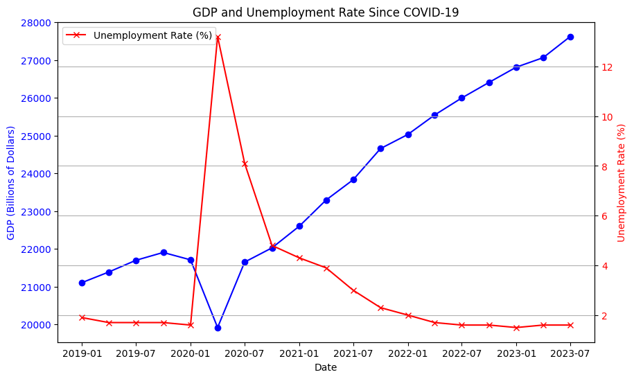

[Open in Kaggle](https://www.kaggle.com/code/mohamedyosef101/economic-data-analysis-with-fredapi)

<div><br></div>


# Economic Data Analysis with Fred
Fred is an economic data website which include a varity of data sources; it's all time series data, financial, and economic data. Beside, they have their own API so there is no need to scrap the website or download csv.

**For now**, I don't know what I going to do yet, but I'm exploring the abilities of Fred and its data.

<br>

```python
# import the essential python libraries
import pandas as pd
import numpy as np
import matplotlib.pyplot as plt
import seaborn as sns
```


<div><br></div>

# Step 0: Set the API
To get my api key, I need to go to [Fred API Keys](https://fred.stlouisfed.org/docs/api/api_key.html) and request an API Key.

And to request this key, I need to: 
1. Register a Fred account using my Google one.
2. Enter a simple message explaining what I'm going to do with the API Key.
3. Finally, accept the Fred rules.

<br>

```python
# installing fredapi
!pip install fredapi
```

    Collecting fredapi
      Downloading fredapi-0.5.1-py3-none-any.whl (11 kB)
    Requirement already satisfied: pandas in /opt/conda/lib/python3.10/site-packages (from fredapi) (2.0.3)
    Requirement already satisfied: python-dateutil>=2.8.2 in /opt/conda/lib/python3.10/site-packages (from pandas->fredapi) (2.8.2)
    Requirement already satisfied: pytz>=2020.1 in /opt/conda/lib/python3.10/site-packages (from pandas->fredapi) (2023.3)
    Requirement already satisfied: tzdata>=2022.1 in /opt/conda/lib/python3.10/site-packages (from pandas->fredapi) (2023.3)
    Requirement already satisfied: numpy>=1.21.0 in /opt/conda/lib/python3.10/site-packages (from pandas->fredapi) (1.23.5)
    Requirement already satisfied: six>=1.5 in /opt/conda/lib/python3.10/site-packages (from python-dateutil>=2.8.2->pandas->fredapi) (1.16.0)
    Installing collected packages: fredapi
    Successfully installed fredapi-0.5.1

<div><br></div>

```python
# import the API key
from fredapi import Fred

# I've made mine api key as a secret config variable
# but for you but your api key here
fred_key = 'put your key here' 

# but me I gonna get my Kaggle secret api key 
from kaggle_secrets import UserSecretsClient
user_secrets = UserSecretsClient()
fred_api = user_secrets.get_secret("fred_api")

# Create fred object
fred = Fred(api_key=fred_api)

# if you want to just use the data, here is it:
thedata = pd.read_csv('/kaggle/input/economic-growth-and-unemployment-rate/gdp_and_unemp.csv')
```

If you want to make you API as secret on GitHub, [read this](https://www.kaggle.com/discussions/general/441975)

And for Kaggle, just go `Add-ons` > `Secrets` and deal with it.


<div><br></div>

# Step 1: Pull the data
I'm going to explore the relationship between the growth rate of the economy and the unemployment rate in the last four years since `COVID-19`. 

**Side Note:**
*I do my search on Fred website first, then get the series id and put it here.*

```python
# Based on my needs, here is the data
gdp = fred.get_series(series_id='GDP')
gdp = pd.DataFrame(gdp)
gdp = gdp.reset_index()
gdp.columns = ['Date', 'GDP'] 

unemp = fred.get_series(series_id='U2RATE')
unemp = pd.DataFrame(unemp)
unemp = unemp.reset_index()
unemp.columns = ['Date', 'Unemp']

# merge the data
merged_data = pd.merge(gdp, unemp, on='Date', how='inner')
merged_data.head(2)
```

<div>
<style scoped>
    .dataframe tbody tr th:only-of-type {
        vertical-align: middle;
    }

    .dataframe tbody tr th {
        vertical-align: top;
    }

    .dataframe thead th {
        text-align: right;
    }
</style>
<table border="1" class="dataframe">
  <thead>
    <tr style="text-align: right;">
      <th></th>
      <th>Date</th>
      <th>GDP</th>
      <th>Unemp</th>
    </tr>
  </thead>
  <tbody>
    <tr>
      <th>0</th>
      <td>1967-01-01</td>
      <td>844.170</td>
      <td>1.6</td>
    </tr>
    <tr>
      <th>1</th>
      <td>1967-04-01</td>
      <td>848.983</td>
      <td>1.6</td>
    </tr>
  </tbody>
</table>
</div>


<div><br></div>

# Step 2: Explore the relationship
Now we have a dataframe with three features; `Date`, `GDP` Gross Domestic Product (Billions of Dollars), and `Unemp` Unemployment Rate (Percent).

```python
# define the time period from 2019 to 2023
merged_data['Date'] = pd.to_datetime(merged_data['Date'])
df = merged_data[(merged_data['Date'] >= '2019-01-01') & (merged_data['Date'] <= '2023-12-31')]
df.head()
```

<div>
<style scoped>
    .dataframe tbody tr th:only-of-type {
        vertical-align: middle;
    }

    .dataframe tbody tr th {
        vertical-align: top;
    }

    .dataframe thead th {
        text-align: right;
    }
</style>
<table border="1" class="dataframe">
  <thead>
    <tr style="text-align: right;">
      <th></th>
      <th>Date</th>
      <th>GDP</th>
      <th>Unemp</th>
    </tr>
  </thead>
  <tbody>
    <tr>
      <th>208</th>
      <td>2019-01-01</td>
      <td>21104.133</td>
      <td>1.9</td>
    </tr>
    <tr>
      <th>209</th>
      <td>2019-04-01</td>
      <td>21384.775</td>
      <td>1.7</td>
    </tr>
    <tr>
      <th>210</th>
      <td>2019-07-01</td>
      <td>21694.282</td>
      <td>1.7</td>
    </tr>
    <tr>
      <th>211</th>
      <td>2019-10-01</td>
      <td>21902.390</td>
      <td>1.7</td>
    </tr>
    <tr>
      <th>212</th>
      <td>2020-01-01</td>
      <td>21706.513</td>
      <td>1.6</td>
    </tr>
  </tbody>
</table>
</div>

<div><br></div>

```python
# Create a figure and axis
fig, ax1 = plt.subplots(figsize=(10, 6))

# Plot GDP on the left y-axis
ax1.plot(df['Date'], df['GDP'], color='b', marker='o', label='GDP (Billions of Dollars)')
ax1.set_xlabel('Date')
ax1.set_ylabel('GDP (Billions of Dollars)', color='b')
ax1.tick_params(axis='y', labelcolor='b')

# Create a second y-axis on the right
ax2 = ax1.twinx()

# Plot Unemployment Rate on the right y-axis
ax2.plot(df['Date'], df['Unemp'], color='r', marker='x', label='Unemployment Rate (%)')
ax2.set_ylabel('Unemployment Rate (%)', color='r')
ax2.tick_params(axis='y', labelcolor='r')

# Set titles and legend
plt.title('GDP and Unemployment Rate Since COVID-19')
plt.legend(loc='upper left', fontsize='medium')

# Show the plot
plt.grid(True)
plt.show()
```

    

    

<div><br></div>

That's all ..

<div><br></div>

### **Project Conclusion:**

As anticipated, our analysis reveals a clear relationship between unemployment rates and GDP fluctuations. Notably, during the challenging year of 2020, when unemployment rates surged, we observed a corresponding decline in GDP. 

This observation underscores a fundamental economic principle: "With lower unemployment rates, we are more likely to achieve higher gross domestic product (GDP)." 


<div><br></div>

# Resources
(1) The first inspiration to even work with Fred API was [Rob Mulla YouTube video about Economic Data Analysis](https://www.kaggle.com/code/robikscube/economic-analysis-with-pandas-youtube-tutorial/notebook)

(2) How to [make you API key as a secret](https://www.kaggle.com/discussions/general/441975) - I put it on a Kaggle discussion

(3) Basic economics concepts on [Khan Academy](https://www.khanacademy.org/economics-finance-domain/macroeconomics/macro-basic-economics-concepts)

(4) The hero of the project without a doubt is the data; here is the [GDP series](https://fred.stlouisfed.org/series/GDP) and the [Unemployment rate series](https://fred.stlouisfed.org/series/U2RATE)

<div><br></div>
