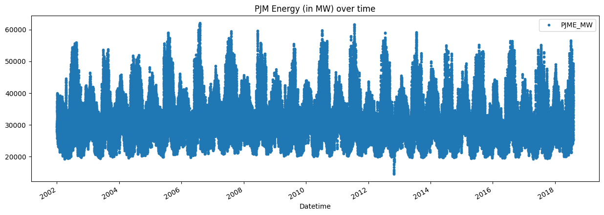
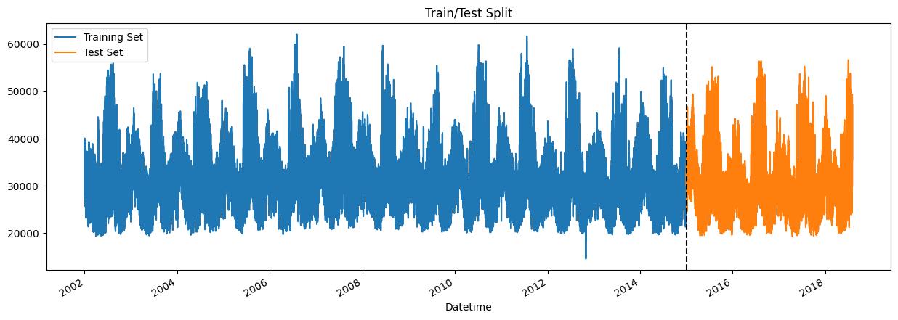
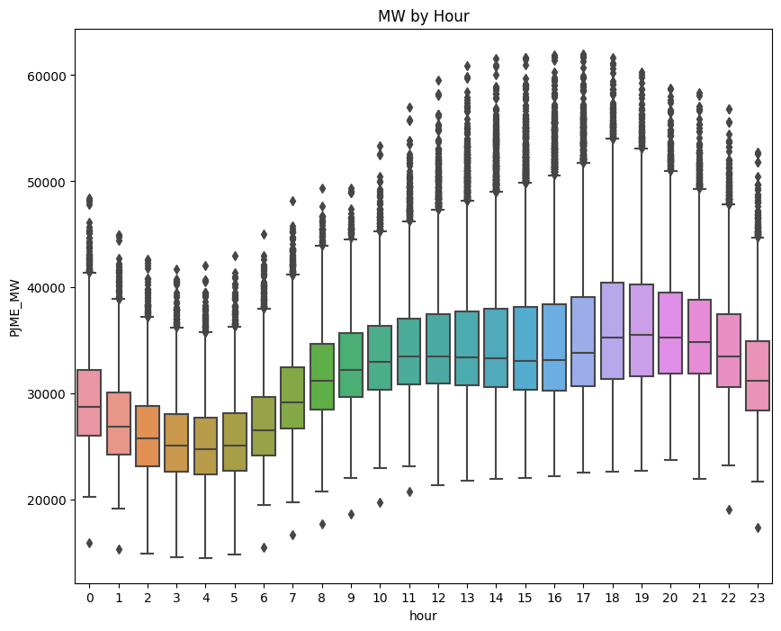
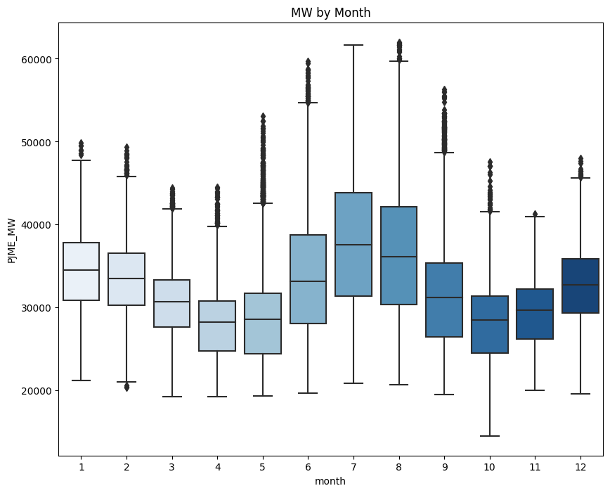
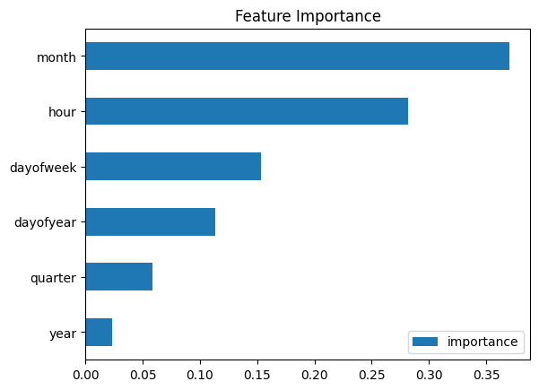
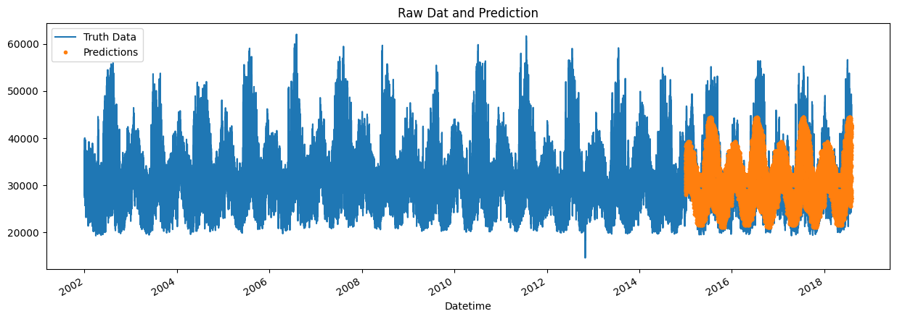

Our goal in this project is to use the hourly power consumption data to predict the PJME in the future. This is done by developing a model that can be used to predict future values based on the past values of the time series.

**DATA**: **[The hourly energy consumption data](https://www.kaggle.com/datasets/robikscube/hourly-energy-consumption)** comes from PJM's website and are in megawatts (MW). 

**GitHub repo**: [mohamedyosef101/energy-time-series-forecasting](https://github.com/mohamedyosef101/energy-time-series-forecasting)


<div><br></div>

# Step 0: Set it up
---

```python
# import the libraries
import pandas as pd
import numpy as np
import matplotlib.pyplot as plt
import seaborn as sns

# customize the style
pd.options.display.float_format = '{:.5f}'.format
pd.options.display.max_rows = 12

# load the data
filepath = '../input/hourly-energy-consumption/PJME_hourly.csv'
df = pd.read_csv(filepath)

print("Now, you're ready for step one")
```

    Now, you're ready for step one

<div><br></div>

# Step 1: Explore the data
---
To better understand the data, I need to create a graph to see the change in PJM Energy over time.

```python
# turn data to datetime
df = df.set_index('Datetime')
df.index = pd.to_datetime(df.index)
```

```python
# create the plot
df.plot(style='.',
        figsize=(15, 5),
        title='PJM Energy (in MW) over time')
plt.show()
```

    



<div><br></div>  

# Step 2: Split the data
---
Everything prior to January 2015 will be our training data and keep our test data as the following dates.

```python
# train / test split
train = df.loc[df.index < '01-01-2015']
test = df.loc[df.index >= '01-01-2015']
```

```python
fig, ax = plt.subplots(figsize=(15, 5))
train.plot(ax=ax, label='Training Set', title='Train/Test Split')
test.plot(ax=ax, label='Test Set')
ax.axvline('01-01-2015', color='black', ls='--')
ax.legend(['Training Set', 'Test Set'])
plt.show()
```

    

    
<div><br></div>

# Step 3: Feature Engineering
---
We're going to create some time features using the `Datetime` index. After that, we'll explore the distributions of `Hourly` and `Monthly` megawatt usage.

```python
# feature creation
def create_features(df):
    df = df.copy()
    df['hour'] = df.index.hour
    df['dayofweek'] = df.index.dayofweek
    df['quarter'] = df.index.quarter
    df['month'] = df.index.month
    df['year'] = df.index.year
    df['dayofyear'] = df.index.dayofyear
    df['dayofmonth'] = df.index.day
    df['weekofyear'] = df.index.isocalendar().week
    return df

df = create_features(df)
```

```python
# visualize the hourly Megawatt
fig, ax = plt.subplots(figsize=(10, 8))
sns.boxplot(data=df, x='hour', y='PJME_MW')
ax.set_title('MW by Hour')
plt.show()
```

    

    
<div><br></div>
<div style="background: #e3eefc; padding: 24px 12px; color: #0000AA; margin: 4px 80px 4px 4px; border-radius: 4px;">
<p style="font-weight: bold;">We can see here that after midnight, the use of energy go down and it gets higher from around 6AM to 6PM and then go down again.</p>
</div>
<div><br></div>

```python
# viaualize the monthly Megawatt
fig, ax = plt.subplots(figsize=(10, 8))
sns.boxplot(data=df, x='month', y='PJME_MW', palette='Blues')
ax.set_title('MW by Month')
plt.show()
```

    

    
<div><br></div>
<div style="background: #e3eefc; padding: 24px 12px; color: #0000AA; margin: 4px 80px 4px 4px; border-radius: 4px;">
<p style="font-weight: bold;">The monthly usage tends to peak here two times in the winter season, then in the fall and sprint it has lower and another peak in the middle of summer.</p>
</div>
<div><br></div>

# Step 4: Modelling
---
`XGBoost` is good and reliable model for regression and time series analysis as well. Also, for the metrics, we'll use `mean squared error`.

<div><br></div>

### 4.1 Prepare the data

```python
# preprocessing
train = create_features(train)
test = create_features(test)

features = ['dayofyear', 'hour', 'dayofweek', 'quarter', 'month', 'year']
target = 'PJME_MW'

X_train = train[features]
y_train = train[target]

X_test = test[features]
y_test = test[target]
```

<div><br></div>

### 4.2 Build the model

```python
import xgboost as xgb
from sklearn.metrics import mean_squared_error

# build the regression model
reg = xgb.XGBRegressor(base_score=0.5, booster='gbtree',    
                       n_estimators=1000,
                       early_stopping_rounds=50,
                       objective='reg:linear',
                       max_depth=3,
                       learning_rate=0.01)
reg.fit(X_train, y_train,
        eval_set=[(X_train, y_train), (X_test, y_test)],
        verbose=100)
```

    [19:42:36] WARNING: ../src/objective/regression_obj.cu:213: reg:linear is now deprecated in favor of reg:squarederror.
    [0]	validation_0-rmse:32605.13860	validation_1-rmse:31657.15907
    [100]	validation_0-rmse:12581.21569	validation_1-rmse:11743.75114
    [200]	validation_0-rmse:5835.12466	validation_1-rmse:5365.67709
    [300]	validation_0-rmse:3915.75557	validation_1-rmse:4020.67023
    [400]	validation_0-rmse:3443.16468	validation_1-rmse:3853.40423
    [500]	validation_0-rmse:3285.33804	validation_1-rmse:3805.30176
    [600]	validation_0-rmse:3201.92936	validation_1-rmse:3772.44933
    [700]	validation_0-rmse:3148.14225	validation_1-rmse:3750.91108
    [800]	validation_0-rmse:3109.24248	validation_1-rmse:3733.89713
    [900]	validation_0-rmse:3079.40079	validation_1-rmse:3725.61224
    [999]	validation_0-rmse:3052.73503	validation_1-rmse:3722.92257

<style>#sk-container-id-1 {color: black;background-color: white;}#sk-container-id-1 pre{padding: 0;}#sk-container-id-1 div.sk-toggleable {background-color: white;}#sk-container-id-1 label.sk-toggleable__label {cursor: pointer;display: block;width: 100%;margin-bottom: 0;padding: 0.3em;box-sizing: border-box;text-align: center;}#sk-container-id-1 label.sk-toggleable__label-arrow:before {content: "▸";float: left;margin-right: 0.25em;color: #696969;}#sk-container-id-1 label.sk-toggleable__label-arrow:hover:before {color: black;}#sk-container-id-1 div.sk-estimator:hover label.sk-toggleable__label-arrow:before {color: black;}#sk-container-id-1 div.sk-toggleable__content {max-height: 0;max-width: 0;overflow: hidden;text-align: left;background-color: #f0f8ff;}#sk-container-id-1 div.sk-toggleable__content pre {margin: 0.2em;color: black;border-radius: 0.25em;background-color: #f0f8ff;}#sk-container-id-1 input.sk-toggleable__control:checked~div.sk-toggleable__content {max-height: 200px;max-width: 100%;overflow: auto;}#sk-container-id-1 input.sk-toggleable__control:checked~label.sk-toggleable__label-arrow:before {content: "▾";}#sk-container-id-1 div.sk-estimator input.sk-toggleable__control:checked~label.sk-toggleable__label {background-color: #d4ebff;}#sk-container-id-1 div.sk-label input.sk-toggleable__control:checked~label.sk-toggleable__label {background-color: #d4ebff;}#sk-container-id-1 input.sk-hidden--visually {border: 0;clip: rect(1px 1px 1px 1px);clip: rect(1px, 1px, 1px, 1px);height: 1px;margin: -1px;overflow: hidden;padding: 0;position: absolute;width: 1px;}#sk-container-id-1 div.sk-estimator {font-family: monospace;background-color: #f0f8ff;border: 1px dotted black;border-radius: 0.25em;box-sizing: border-box;margin-bottom: 0.5em;}#sk-container-id-1 div.sk-estimator:hover {background-color: #d4ebff;}#sk-container-id-1 div.sk-parallel-item::after {content: "";width: 100%;border-bottom: 1px solid gray;flex-grow: 1;}#sk-container-id-1 div.sk-label:hover label.sk-toggleable__label {background-color: #d4ebff;}#sk-container-id-1 div.sk-serial::before {content: "";position: absolute;border-left: 1px solid gray;box-sizing: border-box;top: 0;bottom: 0;left: 50%;z-index: 0;}#sk-container-id-1 div.sk-serial {display: flex;flex-direction: column;align-items: center;background-color: white;padding-right: 0.2em;padding-left: 0.2em;position: relative;}#sk-container-id-1 div.sk-item {position: relative;z-index: 1;}#sk-container-id-1 div.sk-parallel {display: flex;align-items: stretch;justify-content: center;background-color: white;position: relative;}#sk-container-id-1 div.sk-item::before, #sk-container-id-1 div.sk-parallel-item::before {content: "";position: absolute;border-left: 1px solid gray;box-sizing: border-box;top: 0;bottom: 0;left: 50%;z-index: -1;}#sk-container-id-1 div.sk-parallel-item {display: flex;flex-direction: column;z-index: 1;position: relative;background-color: white;}#sk-container-id-1 div.sk-parallel-item:first-child::after {align-self: flex-end;width: 50%;}#sk-container-id-1 div.sk-parallel-item:last-child::after {align-self: flex-start;width: 50%;}#sk-container-id-1 div.sk-parallel-item:only-child::after {width: 0;}#sk-container-id-1 div.sk-dashed-wrapped {border: 1px dashed gray;margin: 0 0.4em 0.5em 0.4em;box-sizing: border-box;padding-bottom: 0.4em;background-color: white;}#sk-container-id-1 div.sk-label label {font-family: monospace;font-weight: bold;display: inline-block;line-height: 1.2em;}#sk-container-id-1 div.sk-label-container {text-align: center;}#sk-container-id-1 div.sk-container {/* jupyter's `normalize.less` sets `[hidden] { display: none; }` but bootstrap.min.css set `[hidden] { display: none !important; }` so we also need the `!important` here to be able to override the default hidden behavior on the sphinx rendered scikit-learn.org. See: https://github.com/scikit-learn/scikit-learn/issues/21755 */display: inline-block !important;position: relative;}#sk-container-id-1 div.sk-text-repr-fallback {display: none;}</style><div id="sk-container-id-1" class="sk-top-container"><div class="sk-text-repr-fallback"><pre>XGBRegressor(base_score=0.5, booster=&#x27;gbtree&#x27;, callbacks=None,
             colsample_bylevel=None, colsample_bynode=None,
             colsample_bytree=None, early_stopping_rounds=50,
             enable_categorical=False, eval_metric=None, feature_types=None,
             gamma=None, gpu_id=None, grow_policy=None, importance_type=None,
             interaction_constraints=None, learning_rate=0.01, max_bin=None,
             max_cat_threshold=None, max_cat_to_onehot=None,
             max_delta_step=None, max_depth=3, max_leaves=None,
             min_child_weight=None, missing=nan, monotone_constraints=None,
             n_estimators=1000, n_jobs=None, num_parallel_tree=None,
             objective=&#x27;reg:linear&#x27;, predictor=None, ...)</pre><b>In a Jupyter environment, please rerun this cell to show the HTML representation or trust the notebook. <br />On GitHub, the HTML representation is unable to render, please try loading this page with nbviewer.org.</b></div><div class="sk-container" hidden><div class="sk-item"><div class="sk-estimator sk-toggleable"><input class="sk-toggleable__control sk-hidden--visually" id="sk-estimator-id-1" type="checkbox" checked><label for="sk-estimator-id-1" class="sk-toggleable__label sk-toggleable__label-arrow">XGBRegressor</label><div class="sk-toggleable__content"><pre>XGBRegressor(base_score=0.5, booster=&#x27;gbtree&#x27;, callbacks=None,
             colsample_bylevel=None, colsample_bynode=None,
             colsample_bytree=None, early_stopping_rounds=50,
             enable_categorical=False, eval_metric=None, feature_types=None,
             gamma=None, gpu_id=None, grow_policy=None, importance_type=None,
             interaction_constraints=None, learning_rate=0.01, max_bin=None,
             max_cat_threshold=None, max_cat_to_onehot=None,
             max_delta_step=None, max_depth=3, max_leaves=None,
             min_child_weight=None, missing=nan, monotone_constraints=None,
             n_estimators=1000, n_jobs=None, num_parallel_tree=None,
             objective=&#x27;reg:linear&#x27;, predictor=None, ...)</pre></div></div></div></div></div>

<div><br></div>

### 4.3 Features importance
We need to see how much these features were used in each of the trees built by `XGBoost` model.

```python
fi = pd.DataFrame(data=reg.feature_importances_,
             index=reg.feature_names_in_,
             columns=['importance'])
fi.sort_values('importance').plot(kind='barh', title='Feature Importance')
plt.show()
```

    

    
<div><br></div>
<div><br></div>

# Step 5: Forecasting on test data
compare the prediction with the actual values.

```python
test['prediction'] = reg.predict(X_test)
df = df.merge(test[['prediction']], how='left', left_index=True, right_index=True)
ax = df[['PJME_MW']].plot(figsize=(15, 5))
df['prediction'].plot(ax=ax, style='.')
plt.legend(['Truth Data', 'Predictions'])
ax.set_title('Raw Dat and Prediction')
plt.show()
```

    

    
<div><br></div>

```python
# RMSE Score
score = np.sqrt(mean_squared_error(test['PJME_MW'], test['prediction']))
print(f'RMSE Score on Test set: {score:0.2f}')
```

    RMSE Score on Test set: 3721.75

```python
# R2 Score
from sklearn.metrics import r2_score

r2 = r2_score(test['PJME_MW'], test['prediction'])
print("R-squared (R2) Score:", r2)
```

    R-squared (R2) Score: 0.6670230260104328

<div><br></div>
<div style="background: #e3eefc; padding: 24px 12px; color: #0000AA; margin: 4px 80px 4px 4px; border-radius: 4px;">
<p style="font-weight: bold;">The result is not that good, but it's a great starting point for your future model.</p>
</div>
<div><br></div>

# Acknowledegments
* Great walk through [Time Series Forecasting with XGBoost](https://www.kaggle.com/code/robikscube/time-series-forecasting-with-machine-learning-yt) by Rob Mulla
* Useful video explaining [what is Time Series Analysis](https://youtu.be/GE3JOFwTWVM?si=YrK_rY1nNUwYljHF) by IBM Technology.

<div><br></div>
