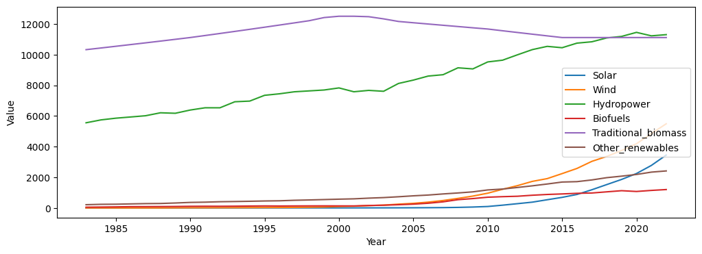
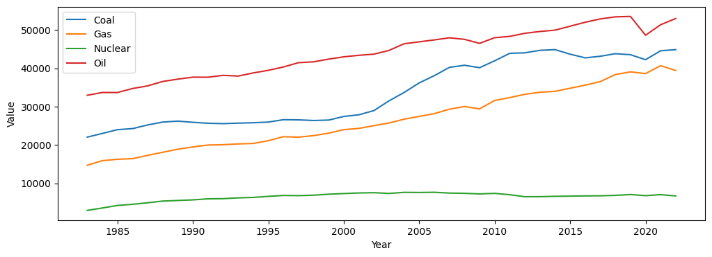

## 1. Renewable Engergy
Explore the change in Solar, Wind, Hydropower, Biofuels, Tranditional Biomass, and Other Renewables (which may include geothermal, tidal, etc.) over the time.

<figure>

<figcaption>Renewable energy consumption from 1983 to 2022</figcaption>
</figure>

As you can see, traditional biomass is going down not higher like the rest. And this because traditional biomass sources like wood, crop residues, and animal dung have relatively low energy efficiency compared to modern renewable sources like solar panels or wind turbines. Which means: the more we have access to more efficient and cleaner energy technologies, the less we'll rely on traditional biomass.

## 2. Non-Renewable Engergy
Exploring the change in Nuclear, Gas, Oil, and Coal.

<figure>

<figcaption>Non-Renewable energy consumption from 1983 to 2022</figcaption>
</figure>

You might noticed that everthing is going up but Nuclear energy is relatively stable. This because Nuclear energy is a reliable baseload energy source (it can generate electricity reliably 24/7), but its growth is limited by safety concerns, cost, and nuclear waste.

## Results
We found that the fastest growing energy source is Solar Energy. This rapid growth is driven by a combination of falling costs, environmental awareness, supportive government policies, and ongoing technological progress. While the slowest  energy source is Tradional biomass becasue they have relatively low energy efficiency compared to modern renewable sources like solar panels or wind turbines.

## Future steps
* **Identify the most and least significant energy sources.** You can do this by calculating the percentage contribution of each energy source to the total energy mix in each year.

* **Identify trends in the energy mix.** For example, you can look at how the relative importance of different energy sources has changed over time. You can also look at how the energy mix has changed in different regions of the world.

* **Identify factors that are driving changes in the energy mix.** For example, you can look at the impact of government policies, technological advancements, and economic conditions.

## Acknoledgment
* This data has been collected, aggregated, and documented by Hannah Ritchie, Pablo Rosado, Edouard Mathieu, Max Roser. [Read the full article](https://ourworldindata.org/energy-production-consumption) and [visit the GitHub](https://github.com/owid/energy-data)