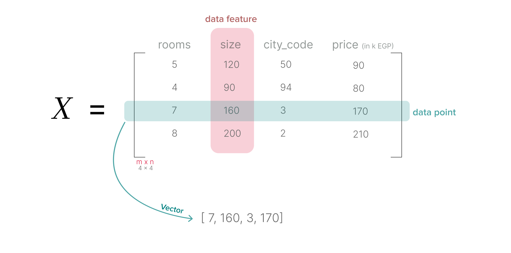
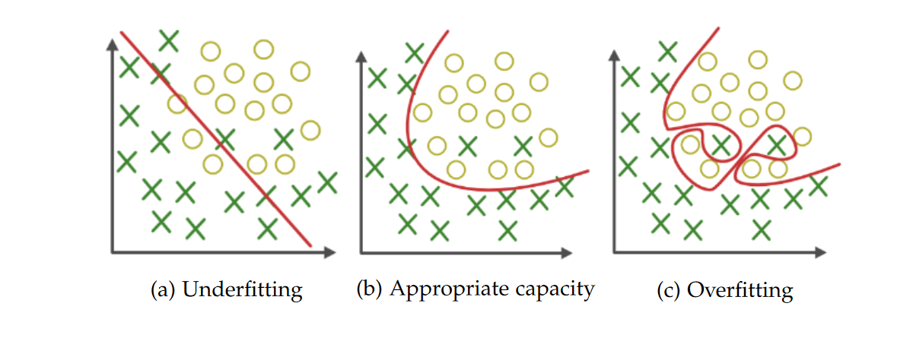
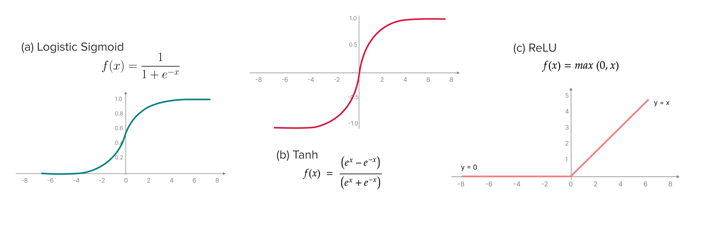

Machine learning (ML) and deep learning (DL) have rapidly transformed from academic papers to  real applications driving innovation across industries. From powering recommendation systems and personal assistants to enabling breakthroughs in healthcare, ML and DL have proven their ability to solve complex problems in ways traditional methods cannot. Despite the vast advancements in both fields, the foundational concepts are valuable for building robust, efficient, and interpretable models.

The importance of understanding these foundations cannot be overstated. Whether you're a beginner or an experienced researcher, grasping the underlying mechanisms of ML and DL models is essential for choosing the right model for a given task, optimising its performance, and ensuring it remains interpretable. In an era where models are often seen as black boxes, this knowledge provides the clarity needed to trust and refine AI systems.

The purpose of this paper is to equip readers with a comprehensive guide to the core principles of machine learning and deep learning. Beyond just understanding the basics, this paper aims to provide the necessary insights to choose, apply, and improve models across various scenarios. By building a solid foundation, readers will be empowered to make informed decisions in developing and enhancing their models, ultimately driving better outcomes in their respective fields.


## 1 Machine Learning

Since machine learning uses data to actually learn, the most efficient way to use data is a matrix. Let's call our matrix $X \in \mathbb R^{m \times n}$, where $n$ is the number of data points, and $m$ is the number of features. A **feature** is a property of the data point represented in a column. Each row of the data matrix $X$ is an example data point, $x \in \mathbb R^m$. You can think of each row as a vector, and each entry of the vector represents the value of the data point for a particular feature.

<figure>
  
  <figcaption>Figure 1: A matrix of house pricing data with some made-up numbers where the features are number of rooms, house size, city, and price. Each row/vector represents a house or a data point while each value in a row called entry.</figcaption>
</figure>

In machine learning, we consider each data point (row) as an example that the model (the AI) learns from. Let’s say I have a friend called Ahmed who wants to be a physician but instead of learning from textbooks and medical school, he decided to learn from patients and see each patient as an example (he just observes now). After observing a good number of patients, Ahmed now has some general rules of how to deal with new patients, and this generalization thing is the core idea behind machine learning.

So, the machine learns by first getting some data points structured in a matrix. After that, you need to manually extract useful features from the data (feature engineering) then pass these data points into the model and finally you will get the result (like explained in [Figure 2](#fig:how-ml-learn)). But the game has not ended yet, you may want to get higher result by getting more data, try other features, or even try another model. I know that this is too much, so what about focusing in this simple question: how to do machine learning? Well, there are three main types of machine learning you need to know...

<figure id="fig:how-ml-learn">
  
  <figcaption>Figure 2: Machine learns from examples by extracting useful features manually then pass these features into a model to get the result.</figcaption>
</figure>


### 1.1 Machine Learning Paradigms

There are three main paradigms in machine learning: supervised, unsupervised, and reinforcement learning. Supervised learning is the most common one in AI. In supervised learning, we are not only given a matrix of data $X$, but each data point $x_i$ also has an associated label, $y_i$ that we want to predict. Inside supervised learning, there are two categories; (1) **regression** where you predict a continuous variable like predicting how much oxygen a COVID-19 patient needs up to four days in advance to help hospitals allocate resources for those in need (<a href="https://arxiv.org/abs/2101.04909" class=citation target="blank">Sriram et al., 2021</a>). And (2) **classification** where you assign objects or data points to predefined categories or classes like detecting skin cancer in the early stages (<a href="https://www.nature.com/articles/s41598-024-59783-0" class=citation target="blank">Nourelhoda and Soliman, 2024</a>).

In **unsupervised learning**, we no longer have labels $Y$. Instead, we pass the data points of the matrix $X$ into the model, hoping that the model can find the pattern in the data. Unsupervised learning techniques give us the ability to explore the structure or the distribution of the data <a href="https://www.packtpub.com/en-th/product/machine-learning-with-pytorch-and-scikit-learn-9781801819312" class="citation" target="blank">Raschka, 2022</a>. A well-known clustering algorithm is k-means clustering (<a href="https://www.semanticscholar.org/paper/Some-methods-for-classification-and-analysis-of-MacQueen/ac8ab51a86f1a9ae74dd0e4576d1a019f5e654ed" class="citation" target="blank">MacQueen, 1967</a>), which learns to assign each data point to one of k clusters such that the distance between all points within the same cluster is minimized. Formally, it partitions the $n$ observations into $k$ sets $S = \{ S_1 , S_2, \dots, S_k \}$ to minimize the difference between a points and the mean of the points in the cluster:

$$
\arg \min_s \sum_{i=1}^k \sum_{x \in S_i} ||x- \mu_i ||^2
$$

where $\mu_i$ is the mean of the points in cluster $S_i$. [Figure 3](#fig:unsupervised) (right) shows an example of k-means clustering applied to the iris data. In this example, with only two features and no access to the true labels, k-means is not able to learn a partitioning of the data into clusters that match the true labels.

<figure id="fig:unsupervised">
  
  <figcaption>Figure 3: Data from the iris dataset proposed by <a href="https://onlinelibrary.wiley.com/doi/10.1111/j.1469-1809.1936.tb02137.x" class="citation" target="blank">Fisher (1936)</a>. The x and y axes are two of the features. The left figure shows the true labels for each of the data points, where red points belong to the setosa class, pink are virginica, and green are versicolor. The right figure shows an assignment of each point to a cluster, learned via k-means clustering (<a href="https://medium.com/@belen.sanchez27/predicting-iris-flower-species-with-k-means-clustering-in-python-f6e46806aaee" class="citation" target="blank">Sanchez, 2018</a>).</figcaption>
</figure>

Another subfield of unsupervised learning is **dimensionality reduction**. Most of the times, it is helpful to work with fewer features (i.e dimensions) and still retaining the meaningful properties of the data, which in turn requires less storage space (<a href="https://www.packtpub.com/en-th/product/machine-learning-with-pytorch-and-scikit-learn-9781801819312" class="citation" target="blank">Raschka, 2022</a>). Additionally, the learning algorithm can run much faster and achieve better performance as we reduce the number of irrelevant features (or noise).

Not all ML problems fall into the supervised/unsupervised division. If you think about how we (as humans) learn and the nature of learning, you will clearly see that you learn by interacting with your world (or environment). At the same time, you are acutely aware of how your world responds to what you do, and your goal is to get the best results through your actions. The same thing happens with our little agent; the agent learns from the world/environment by interacting with it, through trial and error, and receiving rewards; negative or positive as feedback for performing actions. The agent is not told which actions to take at first, but the agent uses the feedback from the environment to discover which actions yield the most reward.

<figure>
  
  <figcaption>Figure 4: Reinforcement learning process starts with the agent observing the state of the environment and take action according to the agent’s policy then receives a reward negative or positive from the environment and move to the next state after that the process repeats. Based on a similar figure in (<a href="https://mitpress.mit.edu/9780262352703/reinforcement-learning/" class=citation target=blank>Sutton & Barto, 2018</a>).</figcaption>
</figure>

**Reinforcement learning** differs from supervised learning; supervised learning is learning from a training set of labelled examples provided by a knowledgeable external supervisor giving the AI the solution and the right action to take in a specific situation. The goal of supervised learning is to generalize a rule for the AI to deal with other situations that are not in the training set. But in real-world interactive problems, the answer often emerges through exploration and trial and error. There might not be a definitive “correct” answer for every situation the agent encounters. Even if there is a right answer for some situations, it will not work well as a general solution (<a href="https://mitpress.mit.edu/9780262352703/reinforcement-learning/" class=citation target=blank>Sutton & Barto, 2018</a>).

Reinforcement learning is also different from unsupervised learning; unsupervised learning is finding structure hidden in the collection of unlabelled data. Understanding the hidden structure can be useful in reinforcement learning, but unsupervised learning itself does not maximize the reward signal.

So, reinforcement learning is the third machine learning paradigm alongside supervised learning and unsupervised learning with a goal to maximize the total rewards that the agent gets from the environment.

### 1.2 Generalization

One of the big challenges in machine learning is to improve generalization, which is the ability to put general rules from seen data to deal with new, unseen data. Basically, we split our data into three subsets: the training, validation, and test sets. Knowing the difference between the training error and the validation error can help us identify two common phenomena: underfitting and overfitting. Underfitting occurs when a model cannot learn from the training data. When the model is able to perfectly predict the training data, it might begin to overfit the data, i.e. the model knows more than enough so it fails to generalize.

<figure>
  
  <figcaption>Figure 5: A classification task where the model must separate class 1 (green X’s) from class 2 (circles). Three decision boundaries are shown in red. Underfitting occurs when the model capacity is not sufficient to accurately partition the data (a). Here, a linear decision boundary is too simple for the curved distribution of the class labels. However, if the model capacity is too great, it may overfit the data, perfectly capturing the idiosyncrasies of the training data at the expense of generalization error (c) (<a href="https://www.geeksforgeeks.org/underfitting-and-overfitting-in-machine-learning/" class=citation target=blank>Nautiyal, 2019</a>).</figcaption>
</figure>

Another idea that is related to overfitting and underfitting is **bias-variance tradeoff**. Firstly, **bias error** happens when the learning algorithm makes incorrect assumptions; e.g. assuming the data is linearly separable when it is curved which leads to underfitting and therefore high error. Secondly, **variance** says how much your results will change if you train the model on a slightly different dataset. 

The **bias-variance tradeoff** is an important idea that relates to overfitting and underfitting. **Bias error** is a result of incorrect assumptions made by the learning algorithm; for example, assuming the true decision boundary is linear when it is actually curved. High bias can lead to underfitting and therefore high training or approximation error. **Variance** ($Var(\hat w)$) describes how much the solution found by the learning algorithm is sensitive to small fluctuations in the training data. If the model has a high variance, we expect that the solution may change significantly if we re-sample a new dataset. High variance can lead to overfitting, where the model learns the quirks and noise in the training data too well, but fails to generalize well to unseen data.

<br>

## 2 Deep learning

Deep learning drives many applications and services, including digital assistants, voice-enabled TV remotes, credit card fraud detection, self-driving cars, and generative AI. Unlike traditional machine learning, deep learning can handle unstructured data, such as text and images, without extensive preprocessing, also deep learning algorithms automate feature extraction, which reduces dependency on human expertise. As shown in Figure 6, the core of deep learning is a neural network that is made up of layers (input, hidden, and output) that contain nodes. Each node computes its output based on a set of weights (or parameters) applied to the output of the previous layer.

<figure>
  
  <figcaption>Figure 6: A simple neural network with two hidden layers (in red), and a one-dimensional output layer (designed with NN-SVG. https://alexlenail.me/NN-SVG).</figcaption>
</figure>


The layer in Figure 6 is the input layer which applies the inputs from data $x$. To compute the output of all the nodes within a layer (say the first hidden), we use matrix multiplication: $h^{(1)} = \phi (W^{(1)}x)$, where $W^{(1)}$ is the matrix of weights (or parameters) for the first hidden layer, while $\phi$ is the activation function. 

### 2.1 Activation Functions

An **activation function** is a fancy way of saying that we are making the output of each neuron nonlinear because we want to learn non-linear relationships between the input and the output. Without a non-linear activation function, even the deepest network is as good as a single one. There are 3 types of activation functions: binary step function, linear function, and — the most important one — nonlinear functions. 

**Binary step function** depends on a threshold value that decides whether a neuron should be activated or not. Basically, we compare the inputs with a certain threshold; if the input is greater than it, then the neuron is activated, else it is deactivated, meaning that its output is not passed on to the next hidden layer. **Linear activation function** is another type of activation functions where the activation is proportional to the input. The function doesn’t do anything to the weighted sum of the input, it simply outputs the value it was given.

<figure>
  
  <figcaption>Figure 7: (a) Binary step activation function when the inputs is greater than or equal to zero, it is activated, else it is deactivated. (b) simple linear activation function follow the equation x = y at any point in real numbers.</figcaption>
</figure>

If you think for a moment, you will find out that step functions and linear functions are difficult to optimize and can not solve a lot of problems. Therefore, **non-linear activation functions** come as a magical way to solve any complex problem, especially the non-linear ones. Common activation functions are logistic sigmoid, Tanh, and rectified linear unit (ReLU). You can see in Figure 8 that **logistic sigmoid** outputs a value between 0 and 1, but suffers from vanishing gradients during training. While **Tanh** is similar to sigmoid but outputs values between -1 and 1. A more frequently used activation function is **ReLU (Rectified Linear Unit)** which is simple and efficient, outputs the input directly if positive, otherwise outputs zero. There are variants of ReLU; like Leaky ReLU that address the "dying ReLU" problem (<a href="https://doi.org/10.48550/arXiv.1505.00853" class=citation target=blank>Bing Xu et al., 2015</a>).

<figure>
  
  <figcaption>Figure 8: Non-linear activation function like logistic sigmoid, Tanh, and ReLU.</figcaption>
</figure>

### 2.2 Loss

Let’s go back to supervised learning to understand some important concepts, such as loss and optimization. As a reminder, in supervised learning, we want to predict the label $y$ given a data point $x$. Therefore, we make a prediction $\hat y = f(x)$. But how can we learn useful information from our prediction? First, we need to define our model and I’m going to use simple **linear regression** as an example: 

$$
\hat y = w^T x
$$

Here, $w$ is a vector containing the weights/parameters of the network and this weight is how much a feature $i$ affects the outcome of the model (e.g. the size of the house may affect the price while the color of the doors may not). So, to measure how good or bad our predictions are, we use a loss function. Common loss functions include **Mean Squared Error (MSE)** which squares the difference between predicted and actual values. Also, we have **Cross-Entropy Loss** which is mostly used for classification problems and measures the probability distribution difference between predictions and true labels. With our linear regression model, I’m going to use the mean squared error loss function: 

$$
\hat L(X,y) = 1/n \sum_{i=1}^{n} (\hat y_i - y_i )^2
$$

We can now minimize this loss by finding the point at which the gradient of the loss with respect to the weights (or parameters) $w$ is zero (i.e., $\nabla_w \hat L = 0$). Thus, we can determine the optimal weight vector:  $w = (X^T X)^{-1} X^T y^T$ (<a href="https://mitpress.mit.edu/9780262035613/deep-learning/" class=citation target=blank>Goodfellow et al., 2016</a>).

In section 1.2, I talked about overfitting and underfitting without presenting a way to fix the problem. Here we’ll use **regularization** as a way to deal with bias-variance tradeoff and hopefully get a better model for generalization. It achieves this by adding a **penalty term** to the loss function, discouraging the model from assigning too much importance to individual features or coefficients. One of the common examples of regularization is **weight decay**, which introduces a penalty on the norm of the weights, e.g.: 

$$
J(w) = \hat L(X, y; w) + \lambda w^T w
$$

where the **hyperparameter** $\lambda$ controls the strength of the penalty. I want you to know that all deep learning algorithms have hyperparameters that must be tuned by testing the model performance.

### 2.3 Optimization

In any machine learning and deep learning model, we want to minimize the loss function by updating the parameters iteratively during training. In traditional machine learning, we can easily optimize the loss and reach the optimal point — the point with the least value of loss — but due to the number of parameters in neural networks, finding the global minimum becomes difficult.

<figure>
  
  <figcaption>Figure 9: Red areas show regions of parameter space where the loss is high, blue areas show regions where the loss is low. Convex loss functions (a) can be found in traditional machine learning models and are easily to optimize, while neural network architectures can lead to complicated loss landscapes (b). Reproduced by <a href="https://www.media.mit.edu/publications/social-and-affective-machine-learning/" class=citation target=blank>Jaques (2019)</a> from <a href="https://doi.org/10.48550/arXiv.1712.09913" class=citation target=blank>Li et al. (2018a)</a>.</figcaption>
</figure>

So, to find a good optimizer, we need a more complicated technique like **gradient-based optimization** which finds the minimum by dividing the loss landscape into steps with size $\alpha$ or learning rate. A most basic gradient algorithm is **stochastic gradient descent (SGD)** where at each step, SGD randomly samples a batch of training data (a smaller group of the dataset) and computes the gradient loss with respect to the model parameters $\nabla_w \hat L(X_B; w)$. The parameters are then updated by moving in the direction of the steepest descent (opposite to the gradient). 

The computational cost of SGD is linear in the size of the batch. Using a smaller batch requires less computation and memory, but introduces more noise to the gradient updates (<a href="https://hdl.handle.net/1866/21139" class=citation target=blank>Dinh, 2018</a>). Beyond SGD, techniques like Adam (<a href="https://arxiv.org/abs/1412.6980" class=citation target=blank>Kingma and Ba, 2014</a>), RMSProp, and Adagrad help escape local minima and converge faster by adaptively adjusting learning rates and computing a moving average of the gradient estimates as a form of **momentum** (<a href="https://ideas.repec.org/p/cor/louvco/2007076.html" class=citation target=blank>Yu, 2007</a>; <a href="https://proceedings.mlr.press/v28/sutskever13.html" class=citation target=blank>Sutskever et al., 2013</a>).

### 2.4 Model life cycle

Model building projects (shown in [Figure 10](#fig:ml-workflow)) follow a well-established life cycle. The first step involves creating a baseline model, a simple initial version that serves as a foundation for further development. Next, you feed your data into the model, which trains it to learn the underlying patterns and relationships. This training process is followed by rigorous testing to evaluate the model's performance. During testing, you can identify issues like overfitting, where the model memorizes the training data too closely and performs poorly on unseen data, or underfitting, where the model fails to capture the complexities of the data and has low accuracy. Based on the results of this evaluation, you can diagnose these issues and make adjustments to improve the model's performance. This might involve trying different algorithms, tweaking parameters, or gathering more data. You then train the improved model again and repeat the entire process until it meets your desired level of accuracy and generalizability.

<figure>
  
  <figcaption>Figure 10: Model building follows a cycle: create a baseline model, train, test, diagnose the issues like overfitting and underfitting, improve, train it again, and repeat this process until it meets your performance goals. (Designed by the author)</figcaption>
</figure>

How to diagnose what’s happening in your model? The first thing that you need to know is that it’s good to have one main metric to evaluate your model, like the MSE that we used before. Other evaluation metrics like **accuracy** which is the proportion of correct predictions for a classification task. We also have **Precision and Recall** (shown in [figure 11](#fig:precision-recall)) are used to measure the ability of the model to identify true positives and avoid false positives/negatives (relevant for imbalanced datasets). Sometimes you want to free your head and use **F1-Score** which is the harmonic mean of precision and recall.

<figure>
  
  <figcaption>Figure 11: Precision and Recall reproduced by Mohamed Yosef from <a href="https://en.wikipedia.org/wiki/Precision_and_recall">Wikipedia</a>.</figcaption>
</figure>

### 2.5 Neural Network Architectures

Until now, we only talked about one type of neural networks which is a fully-connected network or feed-forward neural network. In an image classification problem like MNIST (<a href="https://ieeexplore.ieee.org/document/726791" class=citation target=blank>LeCun et al., 1994</a>) where we have only 28 by 28 pixels which means 784 neurons in the input layer, but what if we have a bigger image say 100 by 100 pixels, this will make our hidden layer contains 10 000 neurons and if we have one hidden layer with 100 neurons, it will need one million parameters which is a huge number of parameters to train for just an image. So, to be more flexible, we can use partially connected layers like in convolutional neural networks (CNNs) (<a href="https://link.springer.com/article/10.1007/BF00344251" class=citation target=blank>Fukushima, 1980</a>; <a href="https://ieeexplore.ieee.org/document/726791" class=citation target=blank>LeCun et al., 1998</a>). These networks contain learned **filters** that are applied across all parts of the input, which is typically an image. In this way, the networks can learn functions which are **translation invariant**. For example, the network can learn a filter to detect a cat, and because it will be applied across many positions in the input image, the network can detect cats in any part of the image. 

<figure>
  
  <figcaption>Figure 12: A brief illustration of a ventral stream of the visual cortex in the human vision system. It consists of primary visual cortex (V1), visual areas (V2 and V4) and inferior temporal gyrus (<a href="https://doi.org/10.48550/arXiv.1702.07800" class=citation target=blank>Wang & Raj, 2017</a>).</figcaption>
</figure>

Another type of architecture is **recurrent neural networks** (RNNs) which model **sequential data**, meaning they have **sequential memory**. An RNN takes in different kinds of inputs (text, words, letters, parts of an image, sounds, etc.) and returns different kinds of outputs (the next word/letter in the sequence, paired with a fully-connected network it can return a classification, etc.). While this can give an RNN a rudimentary form of **memory**, it also exacerbates problems with **vanishing and exploding gradients**. Because computing the gradient depends on multiplying by the same parameter values repeatedly, this can cause the gradients to explode (if the parameter is greater than one) or vanish (if the parameter is less than one). **Long Short-Term Memory** (LSTM) networks (<a href="https://www.bioinf.jku.at/publications/older/2604.pdf" class=citation target=blank>Hochreiter and Schmidhuber, 1997</a>) help to address this problem by adding an **input, output, and forget gate** to each recurrent cell. These gates allow the network to learn when to update the information in the cell and when to erase it, rather than simply multiplying by the same parameters each time.

<figure>
  
  <figcaption>Figure 13: A recurrent neural network with one hidden unit (left) and its unrolling version in time (right). The unrolling version illustrates what happens in time: $S_{t-1}$, $S_t$, and $S_{t+1}$ are the same unit with different states at different time steps. (<a href="http://pages.cs.wisc.edu/~dyer/cs540/handouts/deep-learning-nature2015.pdf" class=citation target=blank>LeCun, Bengio, and Hinton, 2015</a>)</figcaption>
</figure>


Recently, **transformers** have emerged as an alternative to RNNs (Vaswani et al., 2017). These models make use of an **attention** mechanism to summarize inputs of varying lengths based on dynamically changing, learned attention weights. Transformers have been shown to be highly effective at modelling sequences of data, and consequently have led to impressive results in music generation (<a href="https://doi.org/10.48550/arXiv.1809.04281" class=citation target=blank>Huang et al., 2018b) and text generation (<a href="https://d4mucfpksywv.cloudfront.net/better-language-models/language_models_are_unsupervised_multitask_learners.pdf" class=citation target=blank>Radford et al., 2019</a>).


## Final words 
In the article, I tried to get you through the foundation of machine learning and deep learning, but there are many concepts to learn. For this reason, you may like to take a look at the following resources: 
(<a href="https://youtu.be/i_LwzRVP7bg?si=KeY5CgAfQhAdtOGV">Ying, 2022</a>) for traditional ML algorithms, and
(<a href="https://d2l.ai/d2l-en.pdf">Zhang et al., 2021</a>);
(<a href="https://youtube.com/playlist?list=PLM8lYG2MzHmQn55ii0duXdO9QSoDF5myF&si=s1pe9cRtFjKCPqR5">Turp, 2023</a>); 
(<a href="https://youtube.com/playlist?list=PLZHQObOWTQDPD3MizzM2xVFitgF8hE_ab&si=ieGLDzRU2Ln9L0RO">Sanderson, 2017</a>) for deep learning. Also, I'll try to update this article from time to time to make it more informative and easy to understand. At the same time, if you found any error, or you want to give me some suggestions, feel free to email me: mohamedyosef101@outlook.com.

<div align="center">
<p style="font-size: 32px; padding-top: 12px;">تم بحمد الله</p>
</div>


<hr>

cite as 

```
Yosef, M. (2023). The foundations of machine learning and deep learning. MY101. https://mohamedyosef101.github.io/publication/ml-dl-101/
```

<hr>

## References

[1] Natasha Jaques. (2019). [Social and Affective Learning. MIT Media Lab](https://www.media.mit.edu/publications/social-and-affective-machine-learning/). <br>
[2] Goodfellow, I., Courville, A., and Bengio, Y. (2016). [Deep learning](https://mitpress.mit.edu/9780262035613/deep-learning/). MIT Press. <br>
[3] Yu, N. (2007). [Gradient methods for minimizing composite objective function](https://ideas.repec.org/p/cor/louvco/2007076.html). CORE Discussion Papers. <br>
[4] Haohan Wang and Bhiksha Raj. (2017). [On the Origin of Deep Learning](https://doi.org/10.48550/arXiv.1702.07800). <br>
[5] LeCun, Yann, Yoshua Bengio, and Geoffrey Hinton. “[Deep learning](http://pages.cs.wisc.edu/~dyer/cs540/handouts/deep-learning-nature2015.pdf).” Nature 521.7553 (2015): 436-444. <br>
[6] Sebastian Raschka. [Machine Learning with PyTorch and Scikit-Learn](https://www.packtpub.com/en-th/product/machine-learning-with-pytorch-and-scikit-learn-9781801819312). Packt Publishing Limited, feb 2022. ISBN 978-1-80181-931-2 978-1-80181-638-0.