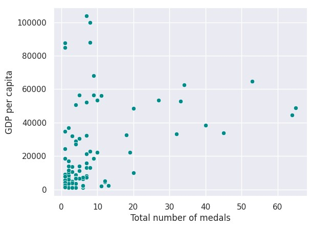
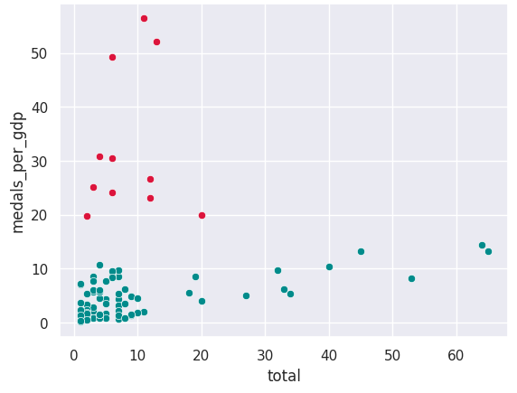
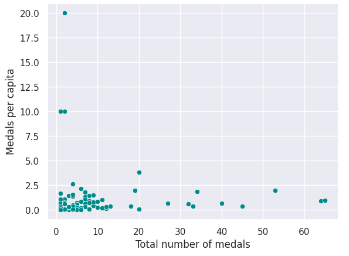

## Research Approach
Instead of focusing on the direct correlation between GDP and medal counts, I developed two key metrics to uncover hidden patterns of success:

- **Medals per GDP**: Measuring Olympic efficiency relative to economic resources
- **Medals per Capita**: Evaluating success relative to population size

This approach helps identify countries that excel despite economic constraints, revealing stories of exceptional athletic development programs and national sporting cultures that transcend economic limitations.

  

## Key Findings

  

### Economic Efficiency in Olympic Performance

Most countries seem clustered around lower GDP values (below 20,000 USD), suggesting that a large number of countries have lower economic performance, but their medal counts vary widely within this range. While some countries with high GDP (above 60,000 USD) still win relatively few medals, suggesting that wealth alone doesn’t guarantee athletic success.

  

### The Overachievers
Three nations emerged as remarkable performers when considering medals per GDP (Uzbekistan, Kenya, and North Korea). These countries demonstrated exceptional efficiency in converting their economic resources into Olympic success, suggesting robust sporting infrastructures and effective talent development systems despite limited financial resources.

### Small Nations, Big Impact
When analysing medals per capita, a different group of overachievers emerged (St Lucia, Dominica, and Grenada). These small nations showed remarkable efficiency in converting their population into Olympic success, suggesting highly focused and effective sporting programs.

## Research Implications
This analysis challenges conventional wisdom about Olympic success. While economic resources certainly play a role, the data reveals that:
1. **Economic Power ≠ Olympic Success**: Some wealthy nations underperform relative to their GDP
2. **Efficient Resource Usage**: Smaller or less wealthy nations can achieve significant success through focused programs
3. **Population Size Impact**: Small nations can excel when measuring success relative to population

## Future Research Directions
This initial analysis opens several promising avenues for future investigation:
1. Developing predictive models for Olympic success based on economic factors
2. Analysing how investment in sports infrastructure impacts performance
3. Studying the evolution of this GDP-medals relationship across multiple Olympic cycles
  

## Methodology Note
The analysis excluded traditional Olympic powerhouses (USA and China) to focus on patterns among other nations. Data includes GDP per capita, population statistics, and medal counts from the Paris 2024 Olympics, analysed using Python with pandas and seaborn libraries.

## Conclusion
This research demonstrates that Olympic success isn't solely a function of national wealth. Countries can achieve remarkable results through efficient resource utilization, focused sporting programs, and effective talent development systems. The findings suggest that smaller or less wealthy nations can compete effectively on the global stage when success is measured relative to their economic and demographic resources.