## What is Reinforcement Learning?
If you think about how you learn and the nature of learning, you will clearly see that you learn by interacting with your world (or environment). In the same time, you are acutely aware of how your world responds to what you do, and your goal is to get the best results through your actions. The same thing happens with our little RL agent; the **agent** learns from the **world/environment** by interacting with it, through trial and error, and receiving **rewards**, negative or positive, as a feedback for performing actions. The agent is not told which actions to take at first, but the agent use the feedback from the environment to discover which actions yield the most reward. 

Reinforcement learning is different from supervised learning; supervised learning is learning from a training set of labeled examples provided by a knowledgeable external supervisor giving the AI the solution and the right action to take in a specific situation. The goal of supervised learning is to generalize a rule for the AI to deal with other situations that is not in the training set. BUT in real world interactive problems, the answer often emerges through exploration and trial-and-error. There might not be a definitive "correct" answer for every situation the agent encounters. Even if there is a right answer for some situations, it will not work well as a general solution.

Reinforcement learning is also different from unsupervised learning; unsupervised learning is finding structure hidden in collection of unlabeled data. Understanding the hidden structure can be useful in reinforcement leaning, but unsupervised leaning itself does not maximize the reward signal.

So, reinforcement learning is the third machine learning paradigm alongside with supervised learning and unsupervised learning with a goal to maximize the total rewards that agent gets from the environment.

## The Reinforcement Learning Process
As you may guess, the RL process begins with the agent observing a situation or a state, $S_t$, from the environment (or the world) to get key information about the state.
1. Based on the state, $S_t$, the agent selects an action, $A_t$, according to its current mindset, policy $\pi$.
2. The agent executes the action in the environment. This changes the situation, the state of the environment.
3. The environment provides a reward, $R_t$  (a numerical value), to the agent based on the consequences of its action. 
4. The agent updates its policy $\pi$ based on this feedback to favor actions the produce higher rewards.
5. The new state of the environment is observed, and the process repeated.

<figure>
  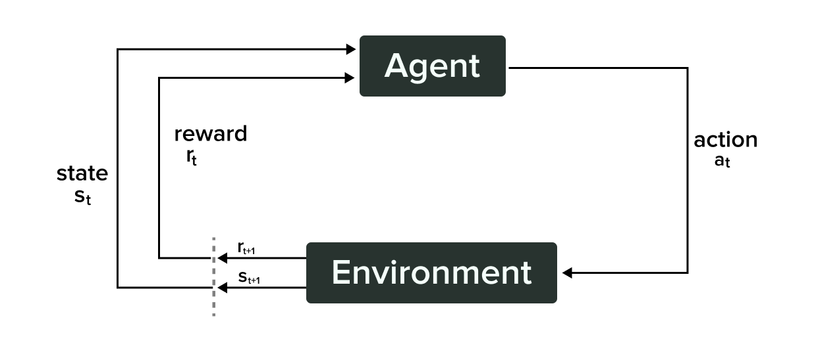
  <figcaption>The Reinforcement Learning Process | <b>Source:</b> <a href="https://mitpress.mit.edu/9780262352703/reinforcement-learning/">Reinforcement learning: An introduction</a> book by Richard S. Sutton and Andrew G. Barto</figcaption>
</figure>

🎯 The agent’s goal is to maximize its expected return (cumulative reward).

## Reinforcement Learning Terminology
A **state** is a representation of the current situation the agent is in within its environment. Each state gives the agent information about the world (environment). An observation *o* is a partial description of a state. Sometimes, the agent has full visibility of the environment (**fully observed**), while other times, it only sees a partial picture (**partially observed**).

### Making choices: Action Spaces
**Action** is the move, or decision made by the agent in a given state of the environment. And the **action space** is the set of all valid moves/actions in a given environment. Think of the action space as the agent’s toolbox. In a game, it might have a set number of moves (**discrete action space**), like jumping or attacking. In continuous environments, the agent might control a robot’s movement with precise values (**continuous action spaces**).

### Deciding what to do: Policies

The **policy** is the agent’s brain, deciding what actions to take based on the observed state. Policy can be deterministic or stochastic;

- **Deterministic Policy:** a logical approach where the agent has a specific action to take for each state ***s*** and denoted by $\mu \rightarrow a_t = \mu_\theta(S_t)$. It’s like having a rule that says, “If X happens, do Y”, with no exceptions. The agent follows the same rule every time it’s in the same situation or state.

- **Stochastic Policy:** more flexible. Instead of one action, the agent has a set of actions and chooses one based on probabilities. Here, policy denoted by $\pi \rightarrow a_t \sim \pi_\theta(\cdot|S_t)$. It’s like flipping a coin to decide what to do. The coin and the flipping have some randomness. You don’t know that you’ll get tail at the first flip and head in the second flip. But what you know is that if you flip the coin many times, you’ll get 50% heads and 50% tails.

### The feedback Loop: Rewards, Return & Discounting

The environment, our agent’s world, provides **rewards** to guide the agent after taking the action. Idea came from points in games; in football, the team gets 3 points for winning and 1 point for a draw and 0 points for losing. In our case, the agent gets the reward based on the current and future state and, of course, the action.

$$
r_t=R(S_t, A_t, S_{t+1})
$$

Instead of individual rewards, we often consider the **return,** which sums up all future rewards. The **discount rate,** gamma $\gamma$, determines how much future rewards matter. A **higher gamma** prioritizes long-term rewards (to take $100 after a year), while a **lower gamma** focuses on immediate rewards (to take $20 now).

**Kinds of return:**

**1- Finite-horizon undiscounted return**, which is just the sum of rewards obtained in a fixed window of steps: $R(\tau)= \sum_{t=0}^{T} r_t$; where tau $\tau$ is the trajectory.

**2- Infinite-horizon discounted return**, which is the sum of all rewards ever obtained by the agent, but discounted by how far off in the future they’re obtained. 

$$
R(\tau)=\sum_{t=0}^{\infty} \gamma^t r_t
$$

> **Important definition**  
> Horizon: number of time steps in each episode; episode: is the agent’s journey from a clear start to a specific end.
> 

### Putting it all together: Trajectory
Sequence of states, actions, and rewards the agent experiences in the world. It’s like playing a game, making choices, and seeing the outcomes — that’s a trajectory!

$$
\tau = (S_0, A_0, S_1, A_1, ...)
$$

## Types of Reinforcement Learning tasks
A task is a specific instance of a problem. There are mainly two categories of tasks: episodic and continuous. **Episodic** tasks have a clear beginning and specific end, or a terminal state. In contrast, **continuous** tasks are ongoing, lacking a definitive endpoint, which requires the agent to improve the policy continuously while interacting with the environment.

<figure>
  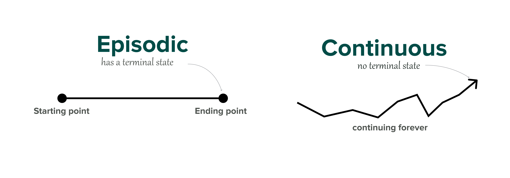
  <figcaption>Types of RL tasks; episodic and continuous | Designed by Mohamed Yosef (the author)</figcaption>
</figure>

## The Exploration/Exploitation trade-off
Sometimes, agents need to explore to learn new things and exploit to use what they know to do well. But the question is still: how to balance between exploration and exploitation?

- **Exploration**: when the agent tries out different things in the environment to learn more about it. It’s like looking around to find new information.

- **Exploitation**: when the agent uses what it already knows to get the best results. It’s like using a map you’ve made to find the quickest route to a treasure.

<figure>
  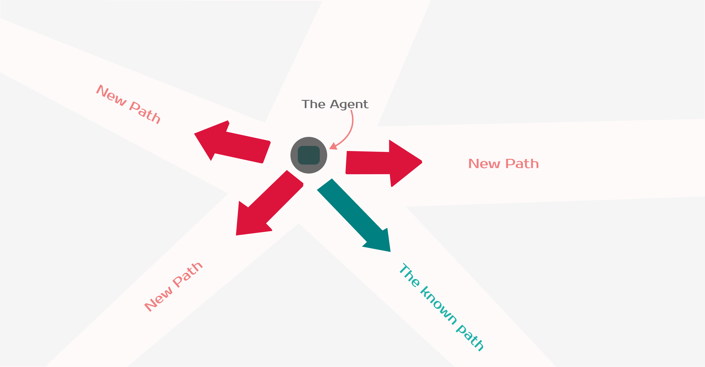
  <figcaption>You have four paths; one that you know so you can exploit your knowledge and choose easily. The other three paths are new so you might want to do some exploration. | <b>Designed</b> by Mohamed Yosef (the author)</figcaption>
</figure>

## Two approaches for solving RL problems
The Policy is the function we want to learn. Our goal is to find the optimal policy π*, the policy that maximizes expected return when the agent acts according to it. We find this π* through training.

There are approaches to find this optimal policy *π**:

- **Directly**, by teaching the agent to learn which action to take, given a state; policy-based methods.

- **Indirectly**, teach the agent to learn which state is more valuable and then take the action that leads to more valuable states; value-based methods.

### Policy-based methods
Focus on directly learning a mapping from states to probabilities of taking specific action. This policy, often stochastic and represented by a neural network, takes the current state as input and outputs a probability distribution over actions.

**Common Algorithms**: REINFORCE, Proximal Policy Optimization (PPO), and Deterministic Policy Gradient (DPG).

### Value-based methods
A category of algorithms that focus on learning the value of states or state-action pairs, rather than directly learning the optimal policy. Value-based methods estimate the expected cumulative reward  associated with being in a particular state, state-value function V(s), or taking a specific action in that state, action-value function Q(s,a).

**Common Algorithms**: SARSA, Q-Learning, and Deep Q-Networks (DQN).

 

## Markov Decision Processes
The major goal of AI and reinforcement learning is to help make better decisions. Markov decision process is a way to set up almost any problem in reinforcement learning. All states in the Markov decision process have MP, Markov property, which means the future only depends on the present, current state, not the past, all previous states:

$$
\mathbb P[S_{t+1}|S_t]= \mathbb P[S_{t+1}|S_1,...,S_t]
$$

Here, we will take about Markov decision processes assuming we have complete information about the environment. In most cases, we don’t know exactly how an environment will react or the rewards for our actions. However, Markov Decision Processes (MDPs) lay the theoretical foundation for many reinforcement learning algorithms.

> **Important definitions:**
> 
> 
> **Model**: is how the environment, world, change in response to the agent’s actions.
> 
> **Model-free**: a world or environment where the agent doesn’t know its dynamics or how it works.
> 
> **Model-based**: the agent has complete information about the environment or the world.
> 

### **Transition dynamics**
A key component of a Markov process is the transition dynamics, which specify **the probability distribution over the next states given the current state**. For example, if a robot starts in state $S_1 = C$, the dynamics describe the chances it transitions to other states $S_2=B$ has a probability of `0.1`. 

<figure>
  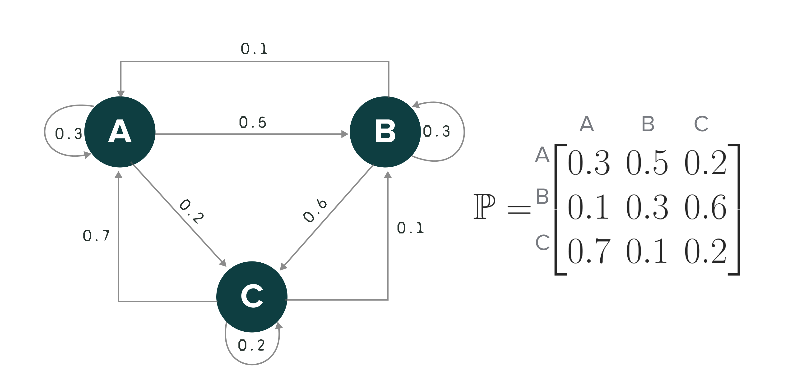
  <figcaption>Markov Transition Dynamics among three states; A, B, and C with the probabilities from moving from one state to the other. | <b>Designed</b> by Mohamed Yosef (the author)</figcaption>
</figure>

### MDP Elements
Markov decision process consists of five elements  $\mathcal{M} = \langle \mathcal{S}, \mathcal{A}, P, R, \gamma \rangle$, where:

- $\mathcal{S}$ → a set of states;
- $\mathcal{A}$ → a set of actions;
- $P$ → transition probability function;
- $R$ → reward function;
- $\gamma$ → discounting factor; specifies how much immediate rewards are favored over future rewards, $\gamma \in [0,1]$, when $\gamma$ equals 1, it implies that the future rewards are equally important as the present rewards. When $\gamma$  equals 0, this implies that we only care about present rewards.

## The Bellman Equations

<figure>
  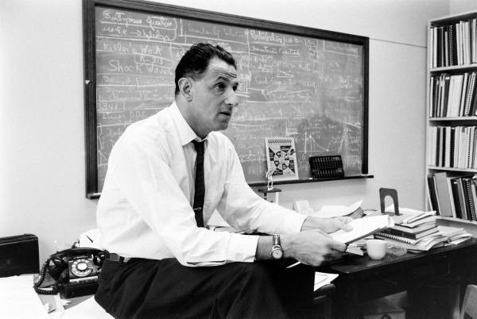
  <figcaption>Dr. Richard Bellman, the father of dynamic programming | <b>Source:</b> <a href="https://www.codeproject.com/Articles/5354014/Dynamic-Programming-or-How-to-Use-Previous-Computa">Dynamic Programming or How to Use Previous Computation Experience</a> — CodeProject.</figcaption>
</figure>

The key idea is that we want to calculate the expected long-term return **starting from any given state**. This is called the value of that state, denoted *V(s)*. One way to calculate *V(s)* is through simulation — we could sample many episodes starting from state, ***s***, calculate the sum of discounted rewards in each one, and take the average.

Formula for state-value function,

$$
\begin{aligned}
V(s) &= \mathbb{E}[G_t \vert S_t = s] \\\
&= \mathbb{E} [R_{t+1} + \gamma R_{t+2} + \gamma^2 R_{t+3} + \dots \vert S_t = s] \\\
&= \mathbb{E} [R_{t+1} + \gamma (R_{t+2} + \gamma R_{t+3} + \dots) \vert S_t = s] \\\
&= \mathbb{E} [R_{t+1} + \gamma G_{t+1} \vert S_t = s] \\\
&= \mathbb{E} [R_{t+1} + \gamma V(S_{t+1}) \vert S_t = s]
\end{aligned}
$$

Similarly, for action-value or Q-value,

$$
\begin{aligned}
Q(s, a) &= \mathbb{E} [R_{t+1} + \gamma V(S_{t+1}) \ | \ S_t = s, A_t = a] \\\
&= \mathbb{E} [R_{t+1} + \gamma \mathbb E_{a \sim \pi} Q(S_{t+1}, a)  \ | \ S_t = s, A_t = a]
\end{aligned}
$$

 

> I took these equations and some more from [this amazing article](https://lilianweng.github.io/posts/2018-02-19-rl-overview/) by Lilian Weng.

 

### Bellman Optimality Equation

If we only care about finding the optimal values and the optimal policy, $\pi^*$, which dictates the best action to take in each state. The Bellman optimality equation gives us a faster way and break down the values recursively, **without having to simulate full episodes (***bootstrapping***)**. It says:

$$
V_*(s)=\max_{a \in \mathcal{A}} \;(R(s, a)+\gamma V(s'))
$$

where:

- **R(s)** is the immediate reward received after taking action, ***a,*** in state, **s.**
- **γ** is the discount factor.
- **V(s’)** is the value of the next state, *s’*, that follows, s.

So instead of calculating V(s) from scratch using many episodes, we can build it up iteratively using the values of the next states.

## Dynamic Programming (DP)

A powerful technique if we have complete information about the environment, model-based learning. The key idea is that dynamic programming breaks down complex problems into smaller, simpler subproblems and then solves them recursively, reusing the solutions of subproblems to find the solution to the larger problem. DP algorithms leverage Bellman equations iteratively to update the value functions, starting from an initial guess and progressively getting closer to the optimal values.

There are two main dynamic programming algorithms: 

**1) Value Iteration, VI**: updates the state-value function, $V(s)$, for all states. 
In each iteration, VI uses the current estimate of $V(s)$ to calculate an improved estimate based on the Bellman optimality equation for $V(s)$. This process continues until the values converge to the optimal $V_*(s)$.

 

$$
\begin{aligned} 
V_{t+1}(s) 
&= \mathbb E_\pi [r + \gamma V_t(s') | S_t = s] \\\ 
&= \sum_a \pi(a \vert s) \sum_{s', r} P(s', r \vert s, a) (r + \gamma V_t(s')) 
\end{aligned}
$$

**2) Policy Iteration, PI**: based on the value functions, PI starts with an initial policy, even a random one, and iteratively improves it. 

$$
\begin{aligned}
Q_\pi(s, a) 
&= \mathbb{E} [R_{t+1} + \gamma V_\pi(S_{t+1}) \vert S_t=s, A_t=a] \\\ 
&= \sum_{s', r} P(s', r \vert s, a) (r + \gamma V_\pi(s')) 
\end{aligned}
$$

In each iteration, PI evaluates the current policy by calculating the state-value function for each state under that policy. Then, it uses this state-value function to find greedy policy, one that takes the action with the highest Q-value in each state. Finally, it compares the new greedy policy to the old one and keeps the one with the higher expected return. This process called Generalized Policy Iteration, GPI.

$$
\pi_0 \xrightarrow[]{\text{evaluation}} V_{\pi_0} \xrightarrow[]{\text{improve}}\pi_1 \xrightarrow[]{\text{evaluation}} V_{\pi_1} \xrightarrow[]{\text{improve}}\pi_2 \xrightarrow[]{\text{evaluation}} \dots \xrightarrow[]{\text{improve}}\pi_* \xrightarrow[]{\text{evaluation}} V_*
$$

This policy iteration process works and always converges to the optimality, but why this is the case? Say, we have a policy $\pi$ and then generate an improved version $\pi'$ by greedily taking actions, $\pi'(s) = arg \; \max_{a \in \mathcal{A}} Q_\pi(s,a)$. The value of this improved $\pi'$ is guaranteed to be better because:

$$
\begin{aligned}
Q_\pi(s, \pi'(s)) 
&= Q_\pi(s, \arg\max_{a \in \mathcal{A}} Q_\pi(s, a)) \\\ 
&= \max_{a \in \mathcal{A}} Q_\pi(s, a) \geq Q_\pi(s, \pi(s)) \\\ 
&= V_\pi(s)
\end{aligned}
$$

## Monte Carlo Methods

Monte Carlo methods estimate the quality of a given policy at the end of an episode. These methods rely on experiencing the environment under the policy’s control and averaging the observed rewards to estimate the value of states and actions. 

> Monte Carlo can **only** be applied to episodic tasks.
> 

A key characteristic of Monte Carlo methods is their reliance on the completion of an episode before calculating the return. The return, denoted by $G_T$, is computed using the following formula: 

$$
G_T=\sum_{k=0}^{T-t-1} \gamma^k R_{t+k+1}
$$

This return is then utilized as the target for value updates:

<figure>
  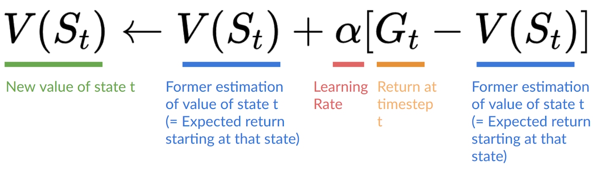
  <figcaption>How Value Function updated in Monte Carlo methods | <b>Source:</b> <a href="https://huggingface.co/learn/deep-rl-course/unit2/mc-vs-td">huggingface.co</a></figcaption>
</figure>

## Temporal Difference Learning

<b>“If one had to identify one idea as central and novel to reinforcement learning, it would undoubtedly be temporal-difference learning.” </b>
 
— Sutton & Barto in their book; <a style="color: teal;" href="https://mitpress.mit.edu/9780262352703/reinforcement-learning/">Reinforcement learning: An introduction</a>.

TD Learning is a combination of dynamic programming and Monte Carlo ideas that estimates the quality of a given policy at each time step, think of it as an exam and your grads are updated after each question, instead of just averaging all grads, returns, at the end of the exam, an episode, like Monte Carlo. 

Because we didn’t experience an entire episode, we don’t have return $G_t$. Instead, we estimate the return by adding reward and the discounted value of the next state, $\gamma\;V(S_{t+1})$:

<figure>
  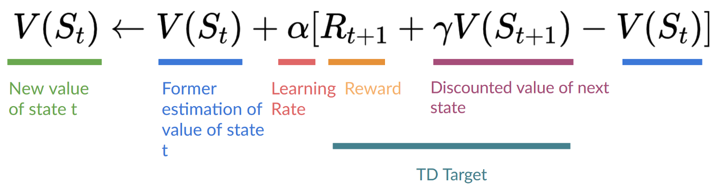
  <figcaption>How the value function updated in TD Learning | <b>Source: </b><a href="https://huggingface.co/learn/deep-rl-course/unit2/mc-vs-td">huggingface.co</a></figcaption>
</figure>

Similarly, for action-value estimation: 

$$
Q(S_t, A_t) \leftarrow Q(S_t, A_t) + \alpha (R_{t+1} + \gamma Q(S_{t+1}, A_{t+1}) - Q(S_t, A_t))
$$

 

### Dynamic Programming, Monte Carlo, and TD Learning Backups

<figure>
  
  <figcaption>Comparison of the backup diagrams of Monte-Carlo, Temporal-Difference learning, and Dynamic Programming for state value functions. | <b>Source: </b> David Silver's RL course <a href="http://www0.cs.ucl.ac.uk/staff/d.silver/web/Teaching_files/MC-TD.pdf">lecture 4</a>: "Model-Free Prediction"</figcaption>
</figure>

 

## Q-Learning and DQN

Q-learning is a model-free, off-policy reinforcement learning algorithm. It empowers an agent, the AI, to learn the best actions to take in various states by using a Temporal Difference (TD) learning approach to optimize its value function.

Here’s a more detailed breakdown:

- **Model-Free**: This term indicates that the agent operates without a predefined model of the environment. It doesn’t have prior knowledge of the environment’s dynamics, meaning it learns solely from its interactions with the environment.
- **Off-Policy**: The agent learns the value of the optimal policy independently of its current action choices. It observes and learns from the actions of other policies, which may differ from its own.
- **TD Learning**: This is a method of learning where the agent continuously updates its evaluations of the states based on the most recent experiences. Think of it as taking a series of quizzes where your grade is adjusted after each question.
- **Value Function**: It represents the expected return (discounted future rewards) that the agent anticipates receiving, starting from a particular state and following a specific policy thereafter.

### How does Q-Learning work?

As usual, our agent needs to learn the optimal policy, the best action to take in each state, that maximizes long-term cumulative reward. With the help of Q-learning, the agent maintains a Q-table that stores Q-values for each state-action pair.

> The Q-values represent the expected future reward for taking that action in that state and following the optimal policy thereafter.
> 

<figure>
  

    
    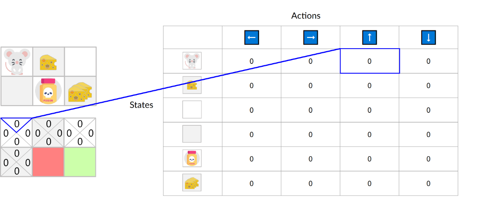
  

  <figcaption> Storing Q-values in Q-table | Source: <a href="https://huggingface.co/learn/deep-rl-course/unit2/q-learning">huggingface.co</a></figcaption>
</figure>

As you see, at the start our Q-values in the Q-table will be all zeros but as learning goes it will change 😉

To understand how this "change" happen, put yourself in the agent’s shoes.

1- You have to interact with the world by taking action, observing the result, reward, and next situation, state, then updating the Q-table using the Bellman equation:

<figure>
  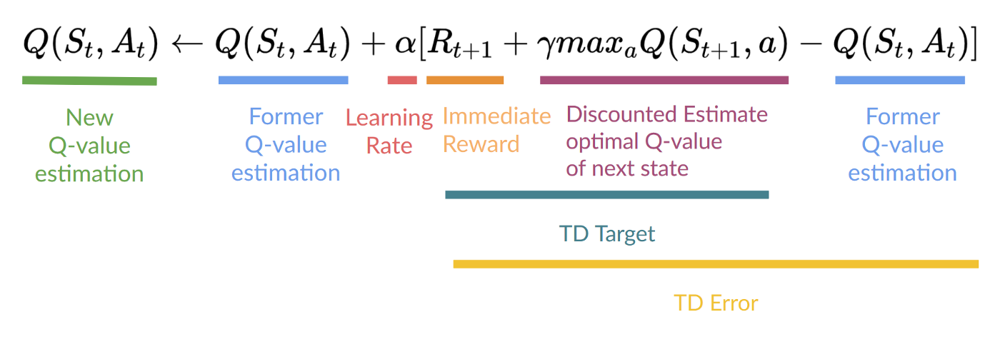
  <figcaption>Estimate the Q-value using Bellman Equation and TD Learning | Source: <a href="https://huggingface.co/learn/deep-rl-course/unit2/q-learning">huggingface.co</a></figcaption>
</figure>

2- You continue to deal with your world, take actions, observing results, rewards, and improving your Q-table.

3- Over time, you’ll learn the optimal policy, the best action to take in a given state, then act according to the optimal policy by simply looking up the best action for each state based on the learned Q-values.

### Deep Q-Learning & DQN
Deep Q-learning is an advanced form of Q-learning that integrates neural networks with reinforcement learning. At its core, it uses a neural network as the agent’s perception system, enabling it to interpret raw environmental data and determine optimal actions. So, you can let the neural network learn the appropriate perception system on its own directly from the environment without the need to do manual feature engineering.

Here’s a refined breakdown:

- **Deep Q-Network (DQN)**: This is the neural network that acts as the agent’s eyes, translating pixel-based images of the environment into actionable data. Unlike humans, computers perceive images as arrays of numbers, and DQN uses a convolutional neural network (CNN) to process these pixel images and estimate the potential rewards (Q-values) for different actions.

- **Temporal Limitation**: A single snapshot of the environment isn’t enough for the agent to make informed decisions. Deep Q-learning addresses this by considering multiple future states, allowing the agent to evaluate actions based on both immediate and future rewards.
    
    <figure>
      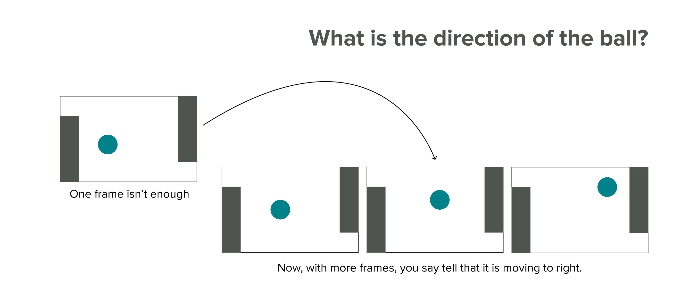
      <figcaption>The problem of temporal difference where one frame or state was not enough to determine the direction of the ball. So we used three frames instead. | Designed by Mohamed Yosef (the author)</figcaption>
    </figure>
    
- **Experience Replay**: To prevent the agent from forgetting previous lessons when encountering new situations, deep Q-learning employs a technique called **Experience Replay**. This involves storing past experiences and revisiting them, which helps the agent maintain a broader understanding of various states and actions.

- **Fixed Targets**: Deep Q-learning uses two separate networks: the main network estimates future rewards, while a secondary “target” network provides a stable baseline for comparison. This dual-network approach helps stabilize learning and prevent feedback loops that could arise from constantly shifting estimations.

## Policy gradient
Unlike value-based methods, which require evaluating each action, policy-based methods use gradient descent to directly improve the policy based on the gradient of the expected return with respect to the policy parameters. So you don’t need separate value function approximation.

### **Advantages**

**1. No exploration/exploitation trade-off by hand.**

Again, in value-based methods like Q-learning, you have to **tune** how often the agent explores randomly vs exploits (*make use of its current knowledge*).

> Common techniques for this are ε-greedy or adding random noise to action selection.
> 

But with policy gradient, you **directly** model a stochastic policy that outputs a probability over actions. So **the agent automatically explores** different states and trajectories because of random sampling from the policy distribution each time-step.

For example, if your policy outputs a 60% chance for action 1 and 40% for action 2, the agent will naturally end up trying action 1 more often, but also frequently explore action 2 without any extra code for exploration vs exploitation.

**2. No more perceptual aliasing**

Perceptual aliasing happens **when two different states appear perceptually similar**, but require different actions to maximize reward.

If you are training a self-driving car and it reaches an intersection. The traffic light may look exactly the same (green light) in multiple environments. However, in a given scenario **with the same green light visual**, there may be ongoing cross traffic that requires your car to continue waiting rather than drive into the intersection.

<figure>
  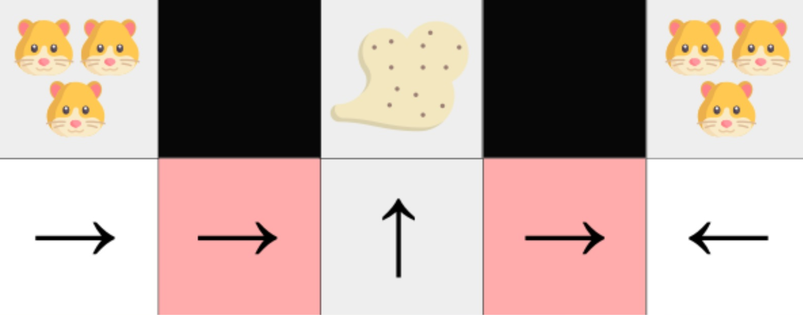
  <figcaption>Cats represents perceptual aliasing; there are two groups of cats each group in a different positions and required different actions to reach the cheese. | Source: <a herf="https://huggingface.co/learn/deep-rl-course/unit4/advantages-disadvantages">huggingface.co</a></figcaption>
</figure>

> Policy gradient methods give distinct probabilities of proceeding vs waiting to the exact same traffic light input depending on the surrounding context.
> 

**3. Effective in high-dimensional action spaces**

As you know deep Q-learning learns a value function — *judging how good each action is at every state*. This works with a **limited** set of actions — you just each action’s score.

But if you have a self-driving car, this means you have infinite actions — tiny variations in wheel angle, brake pressure, etc. Therefore it’s impossible to store a Q-value, reward, for every possible tiny action because you can’t represent infinite values (or maybe you can but it’s not a good thing anyway).

So instead, you can use policy gradients which **directly output a probability distribution over the best actions** based on the state. Rather than rating every individual action choice, they learn a policy that says “*for this state steer 30 degrees left with high probability.*”

### Disadvantages of policy gradient

- **Local Optima:** Policy gradients often get trapped in local maxima rather than the global best policy.
- **Slow Convergence:** They typically learn slower than value methods, incrementally improving the policy over many updates.
- **High Variance:** Gradient estimates used for updating the policy tend to have high variance, causing unstable learning. Actor-critic methods help address this.

### How policy gradient works

The goal of policy gradient methods — *like any RL technique* — is to **find policy parameters that maximize the expected cumulative reward (return).** In our case, a neural network outputs a probability distribution over actions. (*I know everything is about this probability distribution over actions.*)

To measure **policy performance**, you first need to define an objective function that gives the expected return.

<figure>
  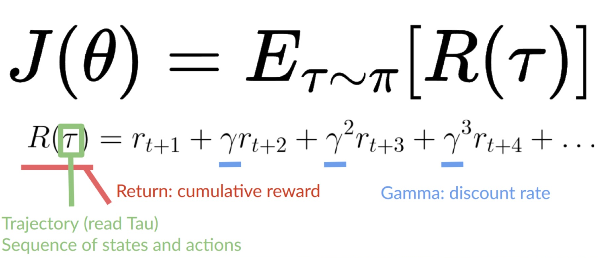
  <figcaption>Objective Function. | source: <a href="https://huggingface.co/learn/deep-rl-course/unit4/policy-gradient">huggingface.co</a></figcaption>
</figure>

You know what… I can’t dive into the policy gradient theorem (*bore me*), but I want you to know that this theorem reformulates the objective so you can estimate its gradient with no need to differentiate the environment dynamics. 

$$
\nabla_{\theta} J(\theta) = \mathbb E_{\pi_{\theta}} [\nabla_{\theta}\text{ log }\pi_{\theta}(a_t \vert s_t) R(\tau)]
$$

### REINFORCE algorithm

The REINFORCE algorithm is a Monte Carlo policy gradient method. It collects episodes using the policy, estimates the gradient from that episode, and updates the policy parameter $\theta$.

A commonly used variation of REINFORCE is to subtract a baseline value from the return $G_t$ to reduce the variance of gradient estimation while keeping the bias unchanged. For example, a common baseline is state-value, and if applied, we would use $A(s,a)=Q(s,a)-V(s)$ in the gradient ascent update.

1. Initialize θ at random
2. Generate one episode $S_1, A_1, R_2, S_2, A_2, \dots, S_T$ 
3. For $t=1, 2, ..., T$:
    1. Estimate the return $G_t$ since the time step t.
    2. $\theta \leftarrow \theta + \alpha \gamma^t G_t \nabla \ln \pi(A_t \vert S_t, \theta)$

### Actor-Critic (A2C)

Combines two key components; **Actor** which aims to choose actions that will lead to high rewards in the long run, and **Critic** helps the actor learn better by providing feedback on the chosen actions.

<figure>
  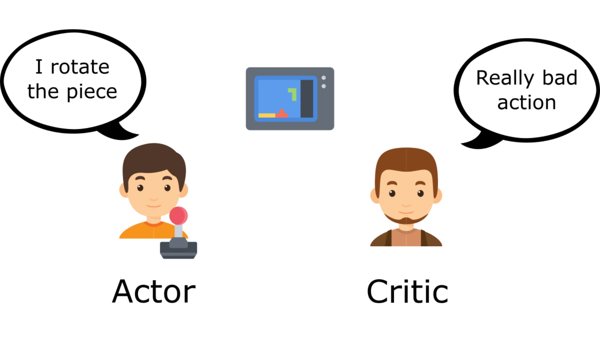
  <figcaption>In the image there is a person playing a game represents the actor and another person saying 'this is a really bad move' represents the critic | source: <a href="https://huggingface.co/learn/deep-rl-course/unit6/advantage-actor-critic">huggingface.co</a></figcaption>
</figure>

The process unfolds as follows in an action-value Actor-Critic algorithm:

1. Initialize states ***s***, policy parameters  $\theta$, and value function parameters ***w*** randomly. Then, sample an action ***a*** from the policy $\pi(a \vert s; \theta)$.
2. For each time step ***t*** from **1** to ***T***:
    - Sample a reward $r_t$ from the reward function $R(s, a)$ and the next state $s'$ from the state transition function $P(s’ \vert s, a)$.
    - Sample the subsequent action ***a’*** from the policy $\pi(s’, a’; \theta)$.
    - Update the policy parameters using the gradient of the policy’s log-probability weighted by the action-value function:
    
    $$
    \theta \leftarrow \theta + \alpha_\theta Q(s, a; w) \nabla_\theta \ln \pi(a \vert s; \theta)
    $$
    
    - Compute the temporal-difference error for the action-value at time ***t***: $G_{t:t+1} = r_t + \gamma Q(s’, a’; w) - Q(s, a; w)$ 
    and use it to update the value function parameters:
     $w \leftarrow w + \alpha_w G_{t:t+1} \nabla_w Q(s, a; w)$
    - Update the action and state for the next iteration:  $a \leftarrow a’ \text{ and } s \leftarrow s’$

Here, $\alpha_\theta$ and $\alpha_w$ represent the learning rates for the policy and value function parameters, respectively.

 

## Future Steps
* I still have a lot of work to do in this article to make it more informative and easy to understand. On the same time, if you found any error, or you want to give me some suggestions, feel free to email me: mohamedyosef101@outlook.com.
* Translation also an important thing for me, so if you can help me to turn this article into Arabic or French, it will be great.

## References
[1] Sutton & Barto. (2018, 2020). [Reinforcement learning: An introduction](https://mitpress.mit.edu/9780262352703/reinforcement-learning/). MIT Press.
[2] Thomas Simonini. (2018). [Deep Reinforcement Learning course](https://huggingface.co/learn/deep-rl-course/unit0/introduction). Hugging Face.
[3] Lilian Weng. (Feb 2018). [A (Long) Peek into Reinforcement Learning](https://lilianweng.github.io/posts/2018-02-19-rl-overview/). Lil’Log.
[4] Duane Rich. (2022). [Reinforcement learning by the book](https://youtube.com/playlist?list=PLzvYlJMoZ02Dxtwe-MmH4nOB5jYlMGBjr&si=M0Si454X5bz9cEbx). YouTube.
[5] Emma Brunskill. (2019). [CS234: Reinforcement Learning](https://youtube.com/playlist?list=PLoROMvodv4rOSOPzutgyCTapiGlY2Nd8u&si=iDTVkCL63ER_LWvm). Stanford Online.
[6] Jem Corcoran. (2023). [Markov Processes](https://youtube.com/playlist?list=PLLyj1Zd4UWrP3rME2XvFvE4Q5vI3H_7_Z&si=HJ_Jg1z5q20oRf45). A Probability Space.