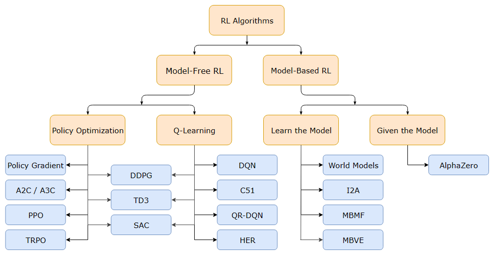




<hr>

Reinforcement Learning, learning through trial and error, is a rapidly growing field in AI. Unlike supervised learning, reinforcement learning provides you with the ability to learn directly from the world and adapt to new situations which makes it a valuable option for complex, real-world problems. From AlphaGo beating the world champion in Go, to the newest updates on large language models and what they can do, RL algorithms with no doubt have a huge impact in the present and the future of automation and Human-AI interaction. With this collection of RL principles, you’ll gain a deeper understand of how RL work and you may gain insights applicable in your own work, leading to innovative solutions.


## 1 What is Reinforcement Learning?

If you think about how you learn and the nature of learning, you will clearly see that you learn by interacting with your world (or environment). In the same time, you are acutely aware of how your world responds to what you do, and your goal is to get the best results through your actions. The same thing happens with our little RL agent; the **agent** learns from the **world or environment** by interacting with it, through trial and error, and receiving **rewards**, negative or positive, as a feedback for performing actions. The agent is not told which actions to take at first, but the agent use the feedback from the environment to discover which actions yield the most reward.

Reinforcement learning is different from supervised learning; supervised learning is learning from a training set of labeled examples provided by a knowledgeable external supervisor giving the AI the solution and the right action to take in a specific situation. The goal of supervised learning is to generalize a rule for the AI to deal with other situations that is not in the training set. BUT in real world interactive problems, the answer often emerges through exploration and trial-and-error. There might not be a definitive "correct" answer for every situation the agent encounters. Even if there is a right answer for some situations, it will not work well as a general solution (<a href="https://mitpress.mit.edu/9780262352703/reinforcement-learning/">Sutton & Barto, 2018</a>).

Reinforcement learning is also different from unsupervised learning; unsupervised learning is finding structure hidden in collection of unlabeled data. Understanding the hidden structure can be useful in reinforcement leaning, but unsupervised leaning itself does not maximize the reward signal.

So, reinforcement learning is the third machine learning paradigm alongside with supervised learning and unsupervised learning with a goal to maximize the total rewards that agent gets from the environment.


### 1.1 Reinforcement Learning Process

The process of reinforcement learning (as shown in [Figure 1](#figure1)) starts with the agent observing a **state** $s_t$ which is a representation of the current situation the agent is in within its environment. Each state gives the agent information about the world (environment). Based on the state, the agent selects an **action** $a_t$ which is the move, or decision made by the agent in a given state of the environment -- the agent decides what to do using **policy** $\pi$, the agent’s brain, decides what actions to take based on the observed state-- then, the environment provides **rewards** $r_t$ to guide the agent after taking the action. The idea of rewards came from points in games; i.e., in football, the team gets 3 points for winning and 1 point for a draw and 0 points for losing.

<figure id="figure1">
  
  <figcaption>Figure 1: Reinforcement Learning process starts with the agent observing the current state in the environment, choosing an action, get a reward from the environment, then adjust the policy, and repeat. Based on a similar figure in (<a href="https://mitpress.mit.edu/9780262352703/reinforcement-learning/">Sutton & Barto, 2018</a>)</figcaption>
</figure>

<p style="color: crimson; font-weight: bold;">🎯 Note: the agent’s goal is to maximize its expected return (cumulative reward).</p>

So, instead of individual rewards, we often consider the **return,** which sums up all future rewards. Since we collect rewards over time, we need a way to determines how much future rewards matter in other words a **discount rate**, gamma, $\gamma$. A higher gamma prioritizes long-term rewards (to take 100 dollar after a year), while a lower gamma focuses on immediate rewards (to take 20 dollar now). To it all together, we have a trajectory $\tau$ which is a sequence of states, actions, and rewards the agent experiences in the world. 

$$
\tau = (s_0, a_0, s_1, a_1, ...)
$$

<br>

### 1.2 Types of Reinforcement Learning tasks
A task is a specific instance of a problem that you face everyday in your job. There are mainly two categories of tasks in reinforcement learning: episodic and continuous as shown in [Figure 2](#figure2). **Episodic** tasks  have a clear beginning and specific end, or a terminal state. In contrast, **continuous** tasks are ongoing, lacking a definitive endpoint, which requires the agent to improve the policy continuously while interacting with the environment.

<figure id="figure2">
  
  <figcaption>Figure 2: Types of RL tasks; episodic (has a terminal state) and continuous that continues forever.</figcaption>
</figure>

### 1.3 The Exploration/Exploitation trade-off
Sometimes, agents need to explore to learn new things and exploit to use what they know to do well. But the question is still: how to balance between exploration and exploitation? **Exploration** is when the agent tries out different things in the environment to learn more about it. It’s like looking around to find new information. Therefore **exploitation** is when the agent uses what it already knows to get the best results. It’s like using a map you’ve made to find the quickest route to a treasure.

<div align="center" id="figure3">
  <figure style="max-width: 540px;">
    
    <figcaption>Figure 3: You have four paths; one that you know so you can exploit your knowledge and choose easily. The other three paths are new so you might want to do some exploration.</figcaption>
  </figure>
</div>

### 1.4 Two approaches for solving RL problems
The Policy is the function we want to learn. Our goal is to find the optimal policy π*, the policy that maximizes expected return when the agent acts according to it. We find this π* through training. There are approaches to find this optimal policy *π**: (1) **Directly**, by teaching the agent to learn which action to take, given a state; policy-based methods. (2) **Indirectly**, teach the agent to learn which state is more valuable and then take the action that leads to more valuable states; value-based methods.

**Policy-based methods** (direct approach) focus on directly learning a mapping from states to probabilities of taking specific action. This policy, often stochastic and represented by a neural network, takes the current state as input and outputs a probability distribution over actions. Common Algorithms are REINFORCE, Proximal Policy Optimization (PPO), and Deterministic Policy Gradient (DPG).

**Value-based methods** (indirect approach) focus on learning the value of states or state-action pairs, rather than directly learning the optimal policy. Value-based methods estimate the expected cumulative reward  associated with being in a particular state, state-value function $V(s)$, or taking a specific action in that state, action-value function $Q(s,a)$. Common Algorithms are SARSA, Q-Learning, and Deep Q-Networks (DQN).

<div><br></div>

## 2 Markov Decision Processes
The major goal of AI and reinforcement learning is to help us make better decisions. Markov decision process is a classical way to set up almost any problem in reinforcement learning. All states in the Markov decision process have MP, Markov property, which means the future only depends on the present, current state, not the past, all previous states:

$$
\mathbb P[s_{t+1}|s_t]= \mathbb P[s_{t+1}|s_1,...,s_t]
$$

Here, we will take about Markov decision processes assuming we have complete information about the environment. In most cases, we don’t know exactly how an environment will react or the rewards for our actions. However, Markov Decision Processes (MDPs) lay the theoretical foundation for many reinforcement learning algorithms. Markov decision process consists of five elements $\mathcal{M} = \langle \mathcal{S}, \mathcal{A}, P, R, \gamma \rangle$, where $\mathcal{S}$ → a set of states; $\mathcal{A}$ → a set of actions; $P$ → transition probability function which specify the probability distribution over the next states given the current state (shown in [Figure 2.1](#figure2-1)); $R$ → reward function; $\gamma$ → discounting factor that specifies how much immediate rewards are favored over future rewards, $\gamma \in [0,1]$, when $\gamma$ equals 1, it implies that the future rewards are equally important as the present rewards. When $\gamma$  equals 0, this implies that we only care about present rewards.

<div align="center">
<figure style="max-width: 540px;" id="figure4">
  
  <figcaption> Figure 4: Markov Transition Dynamics among three states; A, B, and C with the probabilities from moving from one state to the other. Let's say the agent starts in state $s_1 = C$, the dynamics describe the chances it transitions to other states $s_2=B$ has a probability of $0.1$.</figcaption>
</figure>
</div>


### 2.1 The Bellman Equations

The key idea is that we want to calculate the expected long-term return starting from any given state. This is called the value of that state, denoted $V(s)$. One way to calculate $V(s)$ is through simulation — we could sample many episodes starting from state, $s$, calculate the sum of discounted rewards in each one, and take the average. Here is a formula for state-value function (<a href="https://lilianweng.github.io/posts/2018-02-19-rl-overview/">Weng, 2018</a>),

$$
\begin{aligned}
V(s) &= \mathbb{E}[G_t \vert s_t = s] \\\
&= \mathbb{E} [r_{t+1} + \gamma r_{t+2} + \gamma^2 r_{t+3} + \dots \vert s_t = s] \\\
&= \mathbb{E} [r_{t+1} + \gamma (r_{t+2} + \gamma r_{t+3} + \dots) \vert s_t = s] \\\
&= \mathbb{E} [r_{t+1} + \gamma G_{t+1} \vert s_t = s] \\\
&= \mathbb{E} [r_{t+1} + \gamma V(s_{t+1}) \vert s_t = s]
\end{aligned}
$$

Similarly, for action-value or Q-value,

$$
\begin{aligned}
Q(s, a) &= \mathbb{E} [r_{t+1} + \gamma V(s_{t+1}) \ | \ s_t = s, a_t = a] \\\
&= \mathbb{E} [r_{t+1} + \gamma \mathbb E_{a \sim \pi} Q(s_{t+1}, a)  \ | \ s_t = s, a_t = a]
\end{aligned}
$$

<br>

If we only care about finding the optimal values and the optimal policy, $\pi^*$, which dictates the best action to take in each state. The Bellman optimality equation gives us a faster way and break down the values recursively, without having to simulate full episodes (bootstrapping). It says:

$$
V_*(s)=\max_{a \in \mathcal{A}} \;(R(s, a)+\gamma V(s'))
$$

where $R(s)$ is the immediate reward received after taking action $a$ in state $s$; $\gamma$ is the discount factor; $V(s’)$ is the value of the next state $s’$ that follows $s$. So instead of calculating $V(s)$ from scratch using many episodes, we can build it up iteratively using the values of the next states.


<br>

Consider the following figure as a summary of what I'm going to cover in the next three sections.

<figure id="figure5">
  
  <figcaption>Figure 5: Comparison of the backup diagrams of Monte-Carlo, Temporal-Difference learning, and Dynamic Programming for state value functions (<a href="https://youtu.be/PnHCvfgC_ZA?si=_idcaKWaLDalAila">Silver, 2015</a>)
  </figcaption>
</figure>


### 2.2 Dynamic Programming (DP)

A collection of algorithms that can be used to compute optimal policies given a perfect model of the environment as a Markov decision process (MDP).A **model** is how the environment change in response to the agent's actions. While if we have complete information about the environment, we call it **model-based learning** and model-free is the opposite; where we know nothing about the environment dynamics. However in dynamic programming, the key idea is to break down complex problems into smaller, simpler subproblems and then solves them recursively, reusing the solutions of subproblems to find the solution to the larger problem. DP algorithms leverage Bellman equations iteratively to update the value functions, starting from an initial guess and progressively getting closer to the optimal values.

There are two main dynamic programming algorithms value iteration and policy iteration; (1) **Value Iteration, VI** updates the state-value function, $V(s)$, for all states. In each iteration, VI uses the current estimate of $V(s)$ to calculate an improved estimate based on the Bellman optimality equation for $V(s)$. This process continues until the values converge to the optimal $V_*(s)$.

$$
\begin{aligned} 
V_{t+1}(s) 
&= \mathbb E_\pi [r + \gamma V_t(s') | s_t = s] \\\ 
&= \sum_a \pi(a \vert s) \sum_{s', r} P(s', r \vert s, a) (r + \gamma V_t(s')) 
\end{aligned}
$$

(2) **Policy Iteration, PI**: based on the value functions, PI starts with an initial policy, even a random one, and iteratively improves it. 

$$
\begin{aligned}
Q_\pi(s, a) 
&= \mathbb{E} [r_{t+1} + \gamma V_\pi(s_{t+1}) \vert s_t=s, a_t=a] \\\ 
&= \sum_{s', r} P(s', r \vert s, a) (r + \gamma V_\pi(s')) 
\end{aligned}
$$

In each iteration, PI evaluates the current policy by calculating the state-value function for each state under that policy. Then, it uses this state-value function to find greedy policy, one that takes the action with the highest Q-value in each state. Finally, it compares the new greedy policy to the old one and keeps the one with the higher expected return. This process called Generalized Policy Iteration, GPI.

$$
\pi_0 \xrightarrow[]{\text{evaluation}} V_{\pi_0} \xrightarrow[]{\text{improve}}\pi_1 \xrightarrow[]{\text{evaluation}} V_{\pi_1} \xrightarrow[]{\text{improve}}\pi_2 \xrightarrow[]{\text{evaluation}} \dots \xrightarrow[]{\text{improve}}\pi_* \xrightarrow[]{\text{evaluation}} V_*
$$

This policy iteration process works and always converges to the optimality, but why this is the case? Say, we have a policy $\pi$ and then generate an improved version $\pi'$ by greedily taking actions, $\pi'(s) = arg \; \max_{a \in \mathcal{A}} Q_\pi(s,a)$. The value of this improved $\pi'$ is guaranteed to be better because:

$$
\begin{aligned}
Q_\pi(s, \pi'(s)) 
&= Q_\pi(s, \arg\max_{a \in \mathcal{A}} Q_\pi(s, a)) \\\ 
&= \max_{a \in \mathcal{A}} Q_\pi(s, a) \geq Q_\pi(s, \pi(s)) \\\ 
&= V_\pi(s)
\end{aligned}
$$

### 2.3 Monte Carlo Methods

Monte Carlo methods estimate the quality of a given policy at the end of an episode (only episodic tasks). These methods rely on experiencing the environment under the policy’s control and averaging the observed rewards to estimate the value of states and actions. A key characteristic of Monte Carlo methods is their reliance on the completion of an episode before calculating the return. The return, denoted by $G_T$, is computed using the following formula: 

$$
G_T=\sum_{k=0}^{T-t-1} \gamma^k R_{t+k+1}
$$

This return is then utilized as the target for value updates:

$$
V(s_t) \leftarrow V(s_t) + \alpha [G_t - V(s_t)]
$$

<br>

### 2.4 Temporal Difference Learning

<p style="color: teal;"><b>“If one had to identify one idea as central and novel to reinforcement learning, it would undoubtedly be temporal-difference learning.” </b> (<a style="color: teal;" href="https://mitpress.mit.edu/9780262352703/reinforcement-learning/">Sutton & Barto, 2018</a>).
</p>

TD Learning is a combination of dynamic programming and Monte Carlo ideas that estimates the quality of a given policy at each time step, think of it as an exam and your grads are updated after each question, instead of just averaging all grads, returns, at the end of the exam, an episode, like Monte Carlo. Because we didn’t experience an entire episode, we don’t have return $G_t$. Instead, we estimate the return by adding reward and the discounted value of the next state, $\gamma\; V(s_{t+1})$:

$$
V(s_t) \leftarrow V(s_t) + \alpha [r_{t+1} + \gamma V(s_{t+1}) - V(s_t)]
$$

Similarly, for action-value estimation: 

$$
Q(s_t, a_t) \leftarrow Q(s_t, a_t) + \alpha (r_{t+1} + \gamma Q(s_{t+1}, a_{t+1}) - Q(s_t, a_t))
$$

<br>

## 3 RL Algorithms 

<figure id="figure6">
  
  <figcaption>Figure 6: A non-exhaustive, but useful taxonomy of algorithms in reinforcement learning (<a href="https://spinningup.openai.com/en/latest/spinningup/rl_intro2.html">OpenAI, 2018</a>)</figcaption>
</figure>

### 3.1 Q-learning and DQN
I told you before that **model-free** means that the agent doesn't know 
anything about the environment dynamics or how it works. I also want you 
remember that a policy is the agent's brain; it is the center of decision 
making. Therefore, when the agent try to improve this policy by learning 
from its own action, this is called **on-policy**. In contrast, when the 
agent learns from the actions of the others, this is **off-policy**. Now, I 
can say that Q-learning is a model-free, off-policy reinforcement learning 
algorithm. So, rather than learning a value estimate, we learn 
**action-value** or the quality of the action, $Q_\pi(a,s)$, and to get the 
expected future reward of starting in state $s$ and taking action $a$ by 
using a Temporal Difference (TD) learning approach to optimize the value 
function:

$$
Q(s_t, a_t) \leftarrow Q(s_t, a_t) + \alpha [R_{t+1} + 
\gamma \max_a Q(s_{t+1}, a) - Q(s_t, a_t)]
$$

If you recall from [section 1.3](#13-the-explorationexploitation-trade-off), 
the agent doesn't know when to explore and when to exploit. Therefore, Q-learning often uses an epsilon-greedy policy ($\epsilon-greeds$) in which the agent exploits by taking the best action according to the agent information $1 - \epsilon$ times and explore a random action $\epsilon$ times. Using the outsourced policy (epsilon-greed policy), the agent updates the Q-values to determine the best action in each state (agent's policy), aiming for optimal performance. 

Because the environment is stochastic, it is possible to receive different rewards from taking the same action in the same state, so we don't want to overwrite our previous estimate of $Q(a, s)$. Instead, we can create a loss function by squaring the TD error: 

$$
L(s_t, a_t, r_t, s_{t+1}) = (r_t + \gamma \max_{a{t+1}} Q_\pi 
(a_{t+1}, s_{t+1}) - Q_\pi(a_t, s_t))^2 
$$

By iteratively optimizing this loss function using [gradient-based optimization](https://mohamedyosef101.github.io/publication/ml-dl-101/#23-optimization), we can refine our Q-value estimates until they converge to their actual expected value. 

**Deep Q-learning** (<a href="https://arxiv.org/abs/1312.5602">Mnih et al., 2015</a>) is an advanced form of Q-learning that integrates deep neural networks with reinforcement learning. Deep Q-network (DQN) uses a deep neural network to estimate the quality of the action $Q(a, s)$ by treating the state $s$ as input, and having an output neuron for each possible action $K$ to estimate Q(a^k, s). But DQN struggle with temporal limitation where one state in not enough (shown in [Figure 7](#figure3-2)). Deep Q-learning addresses this by considering multiple future states, allowing the agent to evaluate actions based on both immediate and future rewards. Another problem is that the agent sometimes forgets previous lessons, so we first store all observed 
($s_t, a_t, r_t, s_{t+1}$) tuples into an **experience replay** buffer, and randomly sample batches from this buffer to calculate the loss. 

    
<figure id="figure7">
  
  <figcaption>Figure 7: The problem of temporal difference where one frame or state was not enough to determine the direction of the ball. So we used three frames instead.</figcaption>
</figure>
    
In the early stages of Q-learning, the Q estimates are based on very few samples which can be quite noisy and tend to be optimistic about the future rewards. That's why we need to have a **target Q-network** (<a href="https://ojs.aaai.org/index.php/AAAI/article/view/10295">Hasselt et al., 2016</a>) which is initialized randomly, and slowly updated so the parameters move towards the values of the main Q-network (since we now have two the new, target network and the old, main one). 


### 3.2 Policy gradients
Unlike value-based methods (like Q-learning), which require evaluating the quality of each action, policy-based methods use [gradient descent](https://youtu.be/IHZwWFHWa-w?si=kmjGqpC6zbEnNTUM) to directly improve the policy based on the gradient of the expected return $G_t$ with respect to the policy parameter $\theta$. So you don’t need separate value function approximation. Also, the idea behind policy gradients is simple; increasing the probability of actions that led to high rewards, and decreasing the probability of actions that led to negative, low rewards.

The goal of policy gradient methods — *like any RL technique* — is to find policy parameters that maximize the expected cumulative reward (return). In our case, a neural network outputs a probability distribution over actions (I know everything is about this probability distribution over actions). To measure **policy performance**, you first need to define an objective function that gives the expected return over a trajectory based on the policy:

$$
J(\theta) = \mathbb E_{\pi_\theta}[r(\tau)] 
= \mathbb E_{\pi_\theta}[\gamma^t r_t]
$$

You know what… I can’t dive into the policy gradient theorem (*bore me*), but I want you to know that this theorem reformulates the objective so you can estimate its gradient with no need to differentiate the environment dynamics. 

$$
\nabla_{\theta} J(\theta) = \mathbb E_{\pi_{\theta}} [\nabla_{\theta} \log \pi_{\theta}(a_t \vert s_t) r(\tau)]
$$


The first advantage of policy gradients algorithm is how it deals with [exploration/exploitation trade-off](#13-the-explorationexploitation-trade-off) without the need to tune how often the agent should explore vs exploit (e.g., using $\epsilon$-greedy in Q-learning). But with policy gradients, you **directly** model a stochastic policy that outputs a probability over actions. So **the agent automatically explores** different states and trajectories because of random sampling from the policy distribution each time-step. For example, if your policy outputs a 60% chance for action 1 and 40% for action 2, the agent will naturally end up trying action 1 more often, but also frequently explore action 2 without any extra code for exploration vs exploitation. 

Also, when two different states appear to be similar, but require different actions or what we simply call **perceptual aliasing**. For example, if you are training a self-driving car and it reaches an intersection. The traffic light may look exactly the same (green light) in multiple environments. However, in a given scenario with the same green light visual, there may be ongoing cross traffic that requires your car to continue waiting rather than drive into the intersection. Policy gradient methods give distinct probabilities of proceeding vs waiting to the exact same traffic light input depending on the surrounding context.

As you know deep Q-learning learns a value function (judging how good each action is at every state) which works with a *limited* set of actions. But in case of your self-driving car, you have infinite actions (tiny variations in wheel angle, brake pressure, etc.). Therefore it’s impossible to store a Q-value, reward, for every possible tiny action because you can’t represent infinite values (or maybe you can but it’s not a good thing to do anyway). So instead, you can use policy gradients which directly output a probability distribution over the best actions based on the state. Rather than rating every individual action choice, they learn a policy that says “for this state steer 30 degrees left with high probability”.

The problem of any gradient is that the algorithm often get trapped in local maxima rather than the global best policy (the same problem with [optimization](https://mohamedyosef101.github.io/publication/ml-dl-101/#23-optimization) in deep learning). Gradient estimates used for updating the policy tend to have high variance, causing unstable learning. Actor-critic methods help address this.


### 3.3 Actor critic
Actor-Critic methods are a hybrid architecture combining value-based (e.g., Q-learning) and policy-based (e.g., policy gradients). Therefore, it solves the problem of high variance in policy gradients and makes our agent train faster and better. Actor-critic methods have two key components (shown in Figure 8); **Actor** which aims to choose actions that will lead to high rewards in the long run, and **Critic** helps the actor learn better by providing feedback on the chosen actions. With that said, you can see that we have two function approximations (i.e., two neural networks); the first one is a policy function represents the actor while the other one is the value function represents the critic. 

<div align="center">
<figure style="max-width: 540px;">
  
  <figcaption>Figure 8: Two persons; one is playing a game represents the actor and another saying 'this is a really bad move' represents the critic (<a href="https://huggingface.co/learn/deep-rl-course/unit6/advantage-actor-critic">Simonini, 2018</a>).</figcaption>
</figure>
</div>

The process (<a href="https://huggingface.co/learn/deep-rl-course/unit6/advantage-actor-critic">Simonini, 2018</a>) starts at timestep, t, where we get the current state $S_t$ from the environment and pass it as input through our Actor and Critic where our policy takes the state and outputs an action $A_t$. The critic takes takes the action as input as well and computes the quality of the action (Q-value). Since the action is taken, the environment outputs a reward $R_{t+1}$ and a new state $S_{t+1}$. Now, the actor is ready to update its policy using the Q-value: 

$$
\Delta \theta = \alpha \nabla_\theta (\log \pi_\theta (s,a)) \hat q_w(s,a)
$$

where $\Delta\theta$ is the change in policy parameters/weights and $\hat q_w(s,a)$ is the action value estimate. With that, the Actor produces the next action to take $a_{t+1}$ in the new state $s_{t+1}$. The Critic then updates its value parameters: 

$$
\Delta w = \beta (r_{t+1} + \gamma \hat q_w (s_{t+1}, a_{t+1}) 
- \hat q_w (s_t, a_t)) \nabla_w \hat q_w (s_t, a_t)
$$

where $\beta$ is the value learning rate which is different from $\alpha$ (the policy learning rate), $\nabla_w \hat q_w (s_t, a_t)$ is the gradient of our value function, and the rest of the equation is the TD error. 

We can stabilize learning further by directly using the advantage function as Critic instead of the action-value function (<a href="https://huggingface.co/learn/deep-rl-course/unit6/advantage-actor-critic">Simonini, 2018</a>). The idea is that the Advantage function calculates the relative advantage of an action compared to other possible at a state: how taking that action at a state is better compared to the average value of the state. It's subtracting the mean value of the state from the state-action pair: 

$$
\begin{aligned}
A(a,s) &= Q(a,s) - V(s_t) \\\
&= r_t + \gamma V(s_{t+1}) - V(s_t)
\end{aligned}
$$

The advantage function describes how much better the current reward is than what we expect to get. If we substitute the advantage function into policy gradients, we obtain the Advantage Actor-Critic (A2C) algorithm (<a href="https://arxiv.org/abs/1602.01783v2">Mnih et al., 2016</a>): 

$$
\begin{aligned}
\nabla_\theta J(\theta) &= \mathbb E_{\pi_\theta} [[r_t + \gamma V(s_{t+1}) - V(s_t) - V(s_t)] \nabla_\theta \log \pi_\theta (a_t \vert s_t)] \\\
&= \mathbb E_{\pi_\theta} [A(a_t, s_t)\nabla_\theta \log \pi_\theta(a_t \vert s_t)]
\end{aligned}
$$

<br>


## Final words
This article reviewed the basic concepts in reinforcement learning, there are for sure many concepts that I was not able to cover in this article. So, consider the following resources: 
(<a href="https://youtube.com/playlist?list=PLLyj1Zd4UWrP3rME2XvFvE4Q5vI3H_7_Z&si=HJ_Jg1z5q20oRf45">Corcoran, 2023</a>) for Markov processes, 
(<a href="https://mitpress.mit.edu/9780262352703/reinforcement-learning/">Sutton & Barto, 2018</a>) for RL concepts, (<a href="https://huggingface.co/learn/deep-rl-course/unit6/advantage-actor-critic">Simonini, 2018</a>) for some RL implementation, and (<a href="https://www.media.mit.edu/publications/social-and-affective-machine-learning/">Jaques, 2019</a>) for social learning. Also, I'll try to update this article from time to time to make it more informative and easy to understand. At the same time, if you found any error, or you want to give me some suggestions, feel free to email me: mohamedyosef101@outlook.com.

<div align="center">
<p style="font-size: 32px; padding-top: 12px;">تم بحمد الله</p>
</div>
<hr>

cite as 

```
Yosef, M. (2024). Reinforcement learning: All the basics. MY101. https://mohamedyosef101.github.io/publication/rl101/
```
<hr>

## References
[1] Sutton & Barto. (2018, 2020). [Reinforcement learning: An introduction](https://mitpress.mit.edu/9780262352703/reinforcement-learning/). MIT Press. <br>
[2] Thomas Simonini. (2018). [Deep Reinforcement Learning course](https://huggingface.co/learn/deep-rl-course/unit0/introduction). Hugging Face. <br>
[3] Lilian Weng. (Feb 2018). [A (Long) Peek into Reinforcement Learning](https://lilianweng.github.io/posts/2018-02-19-rl-overview/) [Personal]. <br>
[4] Duane Rich. (2022). [Reinforcement learning by the book](https://youtube.com/playlist?list=PLzvYlJMoZ02Dxtwe-MmH4nOB5jYlMGBjr&si=M0Si454X5bz9cEbx). YouTube. <br>
[5] Emma Brunskill. (2019). [CS234: Reinforcement Learning](https://youtube.com/playlist?list=PLoROMvodv4rOSOPzutgyCTapiGlY2Nd8u&si=iDTVkCL63ER_LWvm). Stanford Online. <br>
[6] Jem Corcoran. (2023). [Markov Processes](https://youtube.com/playlist?list=PLLyj1Zd4UWrP3rME2XvFvE4Q5vI3H_7_Z&si=HJ_Jg1z5q20oRf45). A Probability Space. <br>
[7] Natasha Jaques. (2019). [Social and Affective Learning](https://www.media.mit.edu/publications/social-and-affective-machine-learning/). MIT Media Lab.